# ds1edit — Download Page (2011)

> ## Origin
>
> **Original author:** Paul Siramy (`siramy_paul@yahoo.com`)
> **Original page:** `http://paul.siramy.free.fr/_divers/ds1/dl_ds1edit.html`
> — "Diablo II DS1 (map) Editor - Download Page"
> **Archived copy (do not edit):**
> [`docs/preservation/siramy/paul.siramy.free.fr/_divers/ds1/dl_ds1edit.html`](../preservation/siramy/paul.siramy.free.fr/_divers/ds1/dl_ds1edit.html)
> (sha256 `a3c1fe19…a807f6`, retrieved live, per `docs/preservation/MANIFEST.tsv`)
> **Original dates (from the page's own meta tags):** created **2002-03-01**,
> last revised **2011-11-05**. This is the newest page in the Siramy archive.
> **Changed here:** converted from HTML to markdown; stray `<title>` text removed
> from the body; the page's own section headings restored (they had been flattened
> into plain paragraphs); every dead `(#)` link repointed at the archived image it
> originally pointed to, or marked unavailable where the target is a download that
> was never archived; this Origin block added. Siramy's wording is otherwise
> unchanged, including his spelling and punctuation.
>
> **Rights status: the position taken.** This page carries no licence, no
> copyright notice, and no republication grant — and neither does any other
> page in the archive. The project proceeds on an explicit fair-use judgment
> rather than seeking the author's permission, recorded with its reasoning in
> [BOOK-STATUS.md](../BOOK-STATUS.md). If Paul Siramy objects, the terms
> change.
>
> **Version scope:** this is a **historical download page for a discontinued
> tool**, preserved as a record. Every download link on it is dead, and the tool
> it describes was last built in 2011 against Allegro 4.4.2. Nothing below is
> current instruction. Claims about what the editor did are **unverifiable** —
> the binaries are not in this repository and the download host is gone.

---

**Diablo II MAP Editor** — by **Paul SIRAMY**

## Screenshots

Siramy's own feature gallery. Each caption linked to a full-size screenshot;
those screenshots are in the archive and are linked here.

| Preview | Caption | Full size |
|---|---|---|
| 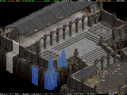 | Overview : Layer toggle, zoom, multi-selection | [big_00.gif](../preservation/siramy/paul.siramy.free.fr/_divers/ds1/screenshots/big_00.gif) |
| 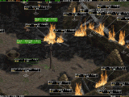 | Objects editing | [big_01.gif](../preservation/siramy/paul.siramy.free.fr/_divers/ds1/screenshots/big_01.gif) |
| 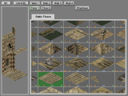 | Tiles editing | [big_02.gif](../preservation/siramy/paul.siramy.free.fr/_divers/ds1/screenshots/big_02.gif) |
| 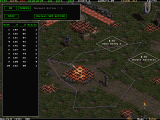 | Paths editing | [big_07.gif](../preservation/siramy/paul.siramy.free.fr/_divers/ds1/screenshots/big_07.gif) |
| 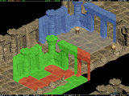 | Copy/paste Tiles : useful real-time preview | [big_03.gif](../preservation/siramy/paul.siramy.free.fr/_divers/ds1/screenshots/big_03.gif) |
| 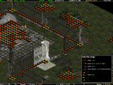 | View accurate infos of Tiles | [big_04.gif](../preservation/siramy/paul.siramy.free.fr/_divers/ds1/screenshots/big_04.gif) |
| 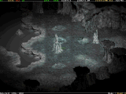 | A toy : Night preview | [big_05.gif](../preservation/siramy/paul.siramy.free.fr/_divers/ds1/screenshots/big_05.gif) |
| 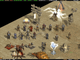 | Objects are almost like in the Game | [big_06.gif](../preservation/siramy/paul.siramy.free.fr/_divers/ds1/screenshots/big_06.gif) |

## Main ZIPs

> Compiled with **Microsoft Visual C++ 2010** and using the library
> **Allegro v 4.4.2**.
> **win_ds1edit_20111030.zip** (5.76 MB), 05 November 2011
> — *download no longer available; the ZIP was not archived.*
>
> Just in case, an older version : compiled with **Microsoft Visual C++ 7.0** and
> using the library **Allegro v 4.2.1**.
> **win_ds1edit_20070423.zip** (607 kB), 23 April 2007
> — *download no longer available; the ZIP was not archived.*
>
> **Don't forget to read the README.TXT that tells how the editor works.**
>
> To see a better **documentation** than the README.TXT, check this
> [documentation page](manual.md) as it contains screenshots and small tutorials.

## Stand-alone DEMO version

> If you don't have the game Diablo II, but still want to try the editor, then
> you have to use this special package. It is composed of the regular editor's
> files, an additional directory that contains a selection of graphical files,
> and a modified ds1edit.ini.

- Get the zip file : **win_ds1edit_demo.zip** (4.83 MB), 23 April 2007
  — *download no longer available; the ZIP was not archived.*
- Un-zip it somewhere on your hard-disk (keep the directory structure when
  extracting **!**)
- You should obtain something like this :

  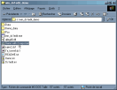
  [(enlarge picture)](../preservation/siramy/paul.siramy.free.fr/_divers/ds1/demo1.gif)

- Double-click on the "**Demo with 2 maps.bat**" file, and the editor is
  initialising :

  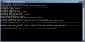
  [(enlarge picture)](../preservation/siramy/paul.siramy.free.fr/_divers/ds1/demo2.gif)

- When it has finished you can fully edit **Tristram** and the **Cairn Stones**
  maps :

  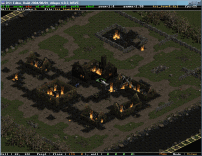
  [(enlarge picture)](../preservation/siramy/paul.siramy.free.fr/_divers/ds1/demo3.gif)

  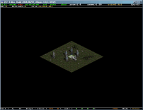
  [(enlarge picture)](../preservation/siramy/paul.siramy.free.fr/_divers/ds1/demo4.gif)

## Source Code (Microsoft Visual C++ 2010, Allegro 4.4.2)

> **win_ds1edit_20111030_src.zip** (160 kB), 05 November 2011, **25326** lines of
> code — *download no longer available; the source ZIP was not archived.*

That line count is Siramy's own, stated on this page; it is **unverified** here,
because the source archive is not in this repository.

## Links

All four links below pointed at the Phrozen Keep forums on `d2mods.com`. That
host no longer serves them; the URLs are kept verbatim as a record of where the
tool was discussed, not as working links.

> **[Main link](http://d2mods.com/forum/viewtopic.php?t=44)**, ds1edit (in the
> Phrozen Keep's Tools Forum)
>
> **[Win32 version](http://d2mods.com/forum/viewtopic.php?t=1316)**,
> win_ds1edit, console version, all Windows platform
>
> If troubles, try to check
> **[here](http://d2mods.com/forum/viewtopic.php?t=270)**
>
> [**General help**](http://d2mods.com/forum/viewtopic.php?t=724#5563)

## Contact

Contact : [siramy_paul@yahoo.com](mailto:siramy_paul@yahoo.com)

---

*Verification report:
[`siramy-conversions.verification.md`](siramy-conversions.verification.md).*
