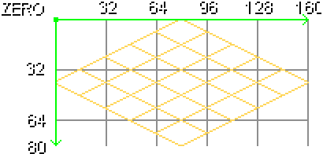
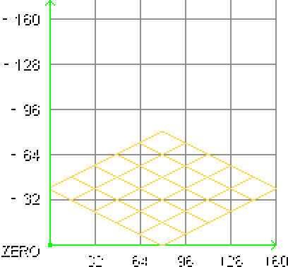
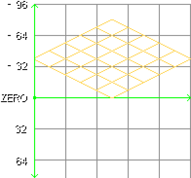
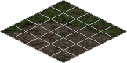
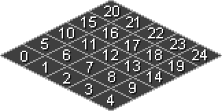
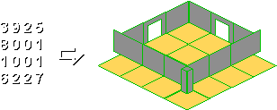
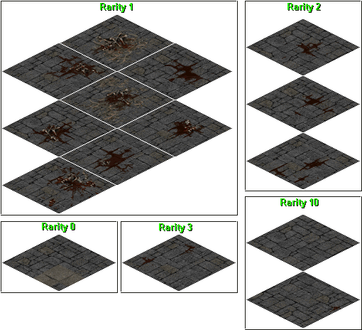

# DT1: Tiles on Disk

> **Origin — reconstructed, not converted.**
> Paul Siramy (`paul.siramy.free.fr`, `paul.siramy@free.fr`) wrote and published a
> DT1 tile-format reference page some time between 2001 and 2011. **That page was
> never captured.** What survived the site's disappearance is its picture
> directory — `_divers/dt1_doc/dt1doc_data/`, twenty-four GIFs with no HTML
> anywhere in the archive that references them — and, in a different directory,
> four C programs Siramy wrote to read and write the format:
> `dt1make.c`, `dt1extr.c`, `dt1info.c`, `dt1debug.c`.
>
> This chapter is a reconstruction of the lost page from those two survivals,
> checked against this repository's own parser, against 354 real `.dt1` files,
> and against the game's own loader in the 1.13c binaries. **The findings are
> Siramy's; the verification and the errors corrected here are this project's.**
> Nothing below is presented as newly discovered that he had already written
> down. Where the reconstruction goes past him — the flag grid confirmed from
> the collision code, the six files nobody's tool can read, the pointers
> Blizzard's compiler left in the padding — it is marked as such.
>
> **Rights: the position taken.** No page in the Siramy archive carries a
> license, a copyright notice, or a republication grant. The images referenced
> below are reproduced from the preservation tree by relative path and are
> Siramy's work. See [`NOTICE`](../../NOTICE) at the repository root for this
> project's standing attribution and the license status of the code derived
> from `win_ds1edit`. Separately, the project proceeds on an explicit
> fair-use judgment for this chapter's use of his images and findings,
> recorded with its reasoning in [BOOK-STATUS.md](../BOOK-STATUS.md). If Paul
> Siramy objects, the terms change.

> **Provenance.** Every structural claim below carries a source tag. Verification
> was performed on 2026-08-21 against:
> - **[G]** the retail 1.13c binaries in Ghidra — `D2CMP.dll` (image base
>   `6fe10000`), `D2Client.dll` (`6fab0000`), `D2Common.dll` (`6fd50000`).
> - **[S]** Paul Siramy's C sources, `docs/preservation/siramy/paul.siramy.free.fr/_divers/dt1/`.
> - **[R]** this repository's parser, [`src/core/dt1.c`](../../src/core/dt1.c),
>   derived from Siramy's `dt1misc.c` but independently maintained.
> - **[D]** real data — every `.dt1` file under `assets/`: 360 files, of which
>   354 parse, 26,005 tile headers and 564,457 sub-tile headers walked byte by
>   byte.
> - **[I]** inference, where no source settles it directly.
>
> A companion audit records every claim, its verdict, and the corrections applied:
> [dt1-tile-format.verification.md](dt1-tile-format.verification.md).

---

## The catalogue, not the map

A `.ds1` file does not contain a single pixel. It is a grid of cells, and each
cell holds four small numbers and an orientation — a *reference*. The picture
those numbers refer to lives somewhere else, in a `.dt1`, and the two files know
about each other only through a three-part key. [DS1: The Map on Disk](ds1-map-format.md)
follows the reference side of that key — the cell layout, the object list, the
warp mechanism — from the other end; this chapter is where the reference
resolves to pixels.

That key is worth seeing before anything else, because it explains most of the
format's shape. When this repository resolves a DS1 wall cell to an actual tile,
it computes ([`src/core/ds1.c:137`](../../src/core/ds1.c), **[R]**):

```c
main_index  = (w_ptr->prop3 >> 4) + ((w_ptr->prop4 & 0x03) << 4);
sub_index   = w_ptr->prop2;
orientation = w_ptr->orientation;
```

and then walks the tile catalogue looking for a block whose `orientation`,
`main_index` and `sub_index` all match. The game does the same thing in
`InsertTileIntoLookupTable` (D2CMP `6fe22f20`, **[G]**), which hashes exactly
that triple into 128 buckets:

```
hash = (sub_index * 2 - orientation + main_index) & 0x7F
```

So a DT1 is a **named catalogue of tiles**. Its blocks are entries, and three of
the fields in every block header exist for no other reason than to be that
entry's name. A DS1 says "give me orientation 1, main 3, sub 0"; the DT1 answers
with pixels. Everything else in the format is either the pixels, or the metadata
the engine needs to place them.

The name of the file itself is never in the file. `LvlTypes.txt` lists which
`.dt1` files a level type loads, the DS1 names none of them, and a level with
eight tilesets loaded has one flat catalogue searched across all eight. Two
tilesets can and do offer the same key — which is a problem the format solves
with a weight, and we will come back to it.

---

## 276 versus 272: the same fact, stated twice

The archive survey that triggered this reconstruction recorded an apparent
disagreement. Siramy's `dt1make.c` opens with:

```c
#define dt1_head_size 276
#define block_size     96
#define sub_tile_size  20
```

while this repository's parser reads the block-header pointer from offset
**272**:

```c
glb_dt1[i].block_num = *(const int32_t *)((UBYTE *)ptr + 268);
glb_dt1[i].bh_start  = *(const int32_t *)((UBYTE *)ptr + 272);
```

These are not two answers to one question. They are answers to two questions,
and both are right.

**272 is where a field lives. 276 is what is in it.** The fixed header is
4 + 4 + 260 + 4 + 4 = 276 bytes; its last field, at offset 272, is a pointer to
the block-header array, and that pointer always holds 276 — the byte immediately
after the header. Siramy's own writer says so in one line and one comment
(`dt1make.c`, `write_dt1_header`, **[S]**):

```c
// start of block header, always 0x114
fwrite(&head_start, 1, 4, dt1);          /* head_start = dt1_head_size = 276 */
```

`0x114` is 276. His reader asserts it (`dt1extr.c`, **[S]**): `if (x1 != 0x114)
is_dt1 = FALSE;`. And this repository defines the same constant Siramy did —
`#define DT1_FIXED_HEADER_SIZE 276` — three lines above the code that reads
offset 272. The survey's "276 vs 272" was a category error, not a conflict.

Three further checks close it:

- **[D]** Across all 354 valid files, the int32 at offset 272 holds **276**, with
  zero exceptions. There is no file in which the "always" is not true.
- **[G]** `OpenResourceAndCalculateSize` (D2CMP `6fe1bad0`) settles it in eight
  instructions. It reserves a `0x118`-byte stack buffer, reads exactly `0x114`
  bytes, takes the dword at `0x10C`, multiplies by `0x60`, and adds `0x114`:

  ```
  6fe1bad0  SUB  ESP, 0x118          ; room for a 0x114-byte header
  6fe1bb10  MOV  EDI, 0x114          ; read 276 bytes
  6fe1bb44  MOV  EAX, [ESP + 0x114]  ; the dword at header offset 0x10C
  6fe1bb4b  LEA  EAX, [EAX + EAX*2]  ; x3
  6fe1bb4e  SHL  EAX, 0x5            ; x32   -> x0x60 = x96
  6fe1bb51  ADD  EAX, 0x114          ; + 276
  ```

  Header size 276, count at 268 (`0x10C`), block stride 96, array at 276. The
  game never reads the pointer at 272 at all during sizing — it *assumes* 276,
  which is why "always 0x114" is a hard truth about the format and not a
  convention.
- **[G]** The writer agrees. `SerializeCelDataToBuffer` (D2CMP `6fe25e20`)
  computes `puVar6 = puVar2 + 0x45` — 0x45 dwords, exactly 0x114 bytes — and
  stores that as the block-header offset unconditionally.

Siramy's number and this repository's number were never in tension. Both
implementations and the game agree on all three strides: **276, 96, 20**.

---

## The fixed header

276 bytes. Everything before the block-header array.

| Offset | Size | Field | Value | Source |
|---|---|---|---|---|
| `0x000` | 4 | `version_major` | always `7` | **[G] [S] [R] [D]** |
| `0x004` | 4 | **flags** (not a version) | reads `6` on disk | **[G]** — see below |
| `0x008` | 260 | filename buffer (`char[260]`) | all zero on disk | **[G] [D]** |
| `0x10C` (268) | 4 | `number_of_blocks` | tile count | **[G] [S] [R] [D]** |
| `0x110` (272) | 4 | `block_header_offset` | always `276` (`0x114`) | **[G] [S] [R] [D]** |

Two of those rows correct the community record.

**Offset 4 is not a version minor.** Every implementation that reads DT1 —
Siramy's, this repository's, and every third-party tool the author is aware of —
treats the file as "version 7.6" and rejects anything else. The value is right;
the interpretation is wrong. In D2CMP the dword at offset 4 is a **flags field**
(**[G]**): `SerializeCelDataToBuffer` writes `puVar2[1] |= 6`;
`BuildTileCelDescriptor` (`6fe26750`) sets bit 0 conditionally;
`FixupCelDataLayout` (`6fe25d10`) tests `(*(byte*)(p+1) & 3)` and then rewrites
`p[1] = p[1] & ~2 | 4`. Bit 1 means *flat / serialized*, bit 2 means *pointers
already fixed up*. Nothing anywhere compares offset 4 against the literal 6. A
shipped tile file reads 6 because bits 1 and 2 are set and bit 0 happens to be
clear — which is a fact about how the tiles were compiled, not about a version
number. The magic that D2CMP *does* check is the `7` at offset 0, twice:
`BuildTileCelDescriptor` writes it, and `FixupCelDataLayout` aborts at
`Tilecmp.cpp:840` if it is missing.

Treating offset 4 as `== 6` is nonetheless safe in practice — all 354 files
carry it (**[D]**) — and this repository still does. The correction matters for
anyone writing a *generator*: setting the field to 6 works because 6 is what
Blizzard's serializer happens to emit, not because 6 is required.

**The 260 zero bytes are a name, not padding.** Every reader in the archive skips
them; `dt1extr.c` even validates that they are zero. They are `char[260]` — a
`MAX_PATH` buffer — and `0x10C - 0x008` is exactly `0x104`, 260. At load time
`FixupCelDataLayout` copies the file's own path into `cel + 8` (**[G]**), and
D2CMP exports a getter (ordinal 10035) that hands the caller a pointer to it.
The file arrives anonymous and the loader writes its name into the hole that was
left for it. All 354 valid files have those 260 bytes zeroed on disk (**[D]**).

---

## The block header: one tile, 96 bytes

The block-header array starts at 276 and runs `number_of_blocks` entries of 96
bytes each. In Siramy's vocabulary a *block* is a tile; this chapter keeps his
word because the community uses it and because "tile" is already overloaded by
the 5×5 sub-tile grid inside one.

| Offset | Size | Field | Notes | Source |
|---|---|---|---|---|
| `+0` | 4 | `direction` | coarse class; derivable from `orientation` — see below | **[S] [R] [D]** |
| `+4` | 2 | `roof_y` | **unsigned**; vertical offset subtracted from the tile's screen Y | **[G] [D]** |
| `+6` | 1 | `sound` | tile footstep-sound index | **[S] [R] [D]** |
| `+7` | 1 | `animated` | non-zero = animated floor | **[S] [R] [D]** |
| `+8` | 4 | `size_y` | always **negative** (or 0) | **[G] [S] [R] [D]** |
| `+12` | 4 | `size_x` | 32/64/96/128/160 | **[G] [S] [R] [D]** |
| `+16` | 4 | *reserved* | literally never written | **[G] [D]** |
| `+20` | 4 | `orientation` | the tile's geometric role, 0–19 | **[G] [S] [R] [D]** |
| `+24` | 4 | `main_index` | catalogue key | **[G] [S] [R] [D]** |
| `+28` | 4 | `sub_index` | catalogue key | **[G] [S] [R] [D]** |
| `+32` | 4 | **`rarity`** | selection weight — *not* a frame number | **[G] [R]** |
| `+36` | 4 | per-file constant | commonly `0x00FF00FF` | **[G] [S] [D]** |
| `+40` | 25 | sub-tile flags, 5×5 | walkability/collision grid | **[G] [S] [R] [D]** |
| `+65` | 7 | *reserved* | zero on disk | **[G] [D]** |
| `+72` | 4 | `tiles_ptr` | **absolute** file offset of the sub-tile header array | **[G] [S] [R] [D]** |
| `+76` | 4 | `tiles_length` | total bytes: headers + pixel data | **[G] [S] [R] [D]** |
| `+80` | 4 | `tiles_number` | number of sub-tiles | **[G] [S] [R] [D]** |
| `+84` | 12 | three runtime pointer slots | zero on disk — *usually* | **[G] [D]** |

### `+32` is rarity, and Siramy called it `frame`

`dt1make.c` and `dt1extr.c` both name this field `frame` and write it out to the
INI as `frame = %08lX` (**[S]**). `dt1info.c` names it `frame` too. This
repository calls it `rarity` (**[R]**). The binary settles it: D2Common's
`SelectRandomTileVariant` (`6fdb8b90`, **[G]**) calls the D2CMP getter for
`block + 0x20` **twice** — once at `6fdb8c29` to accumulate `total += weight`
across all candidate blocks, once at `6fdb8ca5` to walk `remaining -= weight`
against a random number modulo that total. That is textbook weighted random
selection, and the field is the weight.

The repository is right and Siramy's label was wrong. It is a small error with a
long tail: any tool that treats `+32` as an animation frame will silently
mis-sort a catalogue.

The observed distribution supports it (**[D]**): 21,438 blocks carry rarity 0,
3,783 carry 1, and the tail thins fast (2: 379, 3–11: a few hundred, one block
each at 20 and 30). Weights, not frame indices.

### `+84` is three pointers, and 1,378 tiles still hold one

Every reader in the archive calls the last twelve bytes `zeros3` and skips them.
They are not padding. They are three runtime slots that the serializer
deliberately zeroes and the loader fills in place (**[G]**):

| Offset | Slot | Filled by |
|---|---|---|
| `+84` (`0x54`) | pointer to the sub-tile header array | `FixupCelDataLayout` / `LoadCelDataCached` |
| `+88` (`0x58`) | pointer to the file's name | `FixupCelDataLayout`, set to `cel + 8` |
| `+92` (`0x5C`) | LRU cache handle | `LoadCelDataCached` |

Reading every one of the 26,005 block headers on disk turns up something the
decompilation predicts and no reader ever noticed (**[D]**): the twelve bytes are
**not** always zero. In **1,378 blocks** the middle slot — `+88`, the filename
pointer — carries a non-zero value. The first and third slots are zero in every
block without exception.

There are sixteen distinct values. All are four-byte aligned. All fall between
`0x01CD0048` and `0x0B37004C` — the low user heap of a 32-bit Windows process.
They are concentrated entirely in the expansion tilesets (`expansion\Town\buildings.dt1`
alone accounts for 222 of them, `expansion\Siege\trees.dt1` for 143), and they
recur in runs, exactly as sequential allocations from one long-lived pointer
would.

They are leaked heap addresses. Somewhere in the Lord of Destruction tile build,
a compiled tile went out to disk with the loader's own filename pointer still
sitting in the slot the serializer was supposed to clear — a pointer to a string
in a process that exited a quarter of a century ago. The game does not care: the
loader overwrites all three slots on load, which is why the bug shipped and why
nobody has found it. The empirical survey and the decompiled writer arrived at
the same field independently, and each is what makes the other legible.

### `direction` is a function of `orientation`

`dt1extr.c` uses `direction` and `orientation` together to classify a block
(**[S]**):

```c
if ( ((block_ptr->direction == 3) && (block_ptr->orientation == 0)) ||
     ((block_ptr->direction == 5) && (block_ptr->orientation == 15)) )
   /* floor */
```

Which raises the question of whether `direction` carries information
`orientation` does not. Across 17,230 blocks in Blizzard's own tilesets — the 259
readable files under `assets/tiles/`, excluding the 94 Project Diablo 2 additions
— it does not. **Every one of the twenty orientation values maps to exactly one
direction value, at 100%, with no exceptions** (**[D]**):

| `orientation` | 0 | 1 | 2 | 3 | 4 | 5 | 6 | 7 | 8 | 9 | 10 | 11 | 12 | 13 | 14 | 15 | 16 | 17 | 18 | 19 |
|---|---|---|---|---|---|---|---|---|---|---|---|---|---|---|---|---|---|---|---|---|
| `direction` | 3 | 1 | 2 | 3 | 3 | 1 | 2 | 4 | 1 | 2 | 1 | 2 | 3 | 3 | 3 | 5 | 6 | 7 | 8 | 9 |

The mod tiles are where it breaks. In `assets/tiles/PD2assets/`, orientations
7, 9, 16, 17, 18 and 19 each carry a minority of blocks with a *different*
direction — 18% of the lower walls, and orientation 19 splits three ways. This is
the signature of a third-party compiler that never learned the rule, and it is
harmless precisely because nothing in 1.13c branches on `direction`. D2CMP stores
it (`CloneTileDirection` copies it from the last integer argument of
`CreateTileDirectionEntry`) and exports a getter for it (ordinal 10099,
`6fe25240`), but no code path in the three DLLs examined reads it to make a
decision (**[G]**).

**[I]** The most economical reading is that `direction` is a coarser
pre-1.10-era classification that `orientation` superseded and which the tile
compiler kept emitting. That is inference; the binaries neither confirm nor deny
it.

---

## The sub-tile header: 20 bytes, and a width correction

A block's pixels are not one image. They are a set of 32-pixel-wide fragments,
each with its own small header, packed after the header array. `tiles_ptr` points
at the array; `tiles_number` says how long it is; the pixel data follows
immediately.

| Offset | Size | Field | Source |
|---|---|---|---|
| `+0` | 2 | `x_pos` — pixel column within the block | **[G] [S] [R] [D]** |
| `+2` | 2 | `y_pos` — pixel row, signed, origin depends on class | **[G] [S] [R] [D]** |
| `+4` | 2 | *reserved* — zero in all 564,457 sub-tiles | **[G] [D]** |
| `+6` | 1 | `x_grid` — `i % 5` | **[G] [S] [R] [D]** |
| `+7` | 1 | `y_grid` — `i / 5` | **[G] [S] [R] [D]** |
| `+8` | 2 | `format` — bitfield; `1` = isometric | **[G] [S] [R] [D]** |
| `+10` | **2** | `length` — bytes of pixel data (**uint16**, not int32) | **[G]** |
| `+12` | 2 | *reserved* — never written | **[G] [D]** |
| `+14` | 2 | *reserved* — zero in all 564,457 sub-tiles | **[G] [D]** |
| `+16` | 4 | `data_offset` — **relative to `tiles_ptr`** | **[G] [S] [R] [D]** |

**The length field is sixteen bits.** Siramy declared it `long` and this
repository reads it as `int32_t`; both work, because bytes `+12..+15` are never
written and always zero. But the format's own contract is 16-bit. Every access in
D2CMP is a `ushort` (**[G]**) — in `CalculateTileResourceSize`,
`FixupCelDataLayout`, `SerializeSubtileData` — and two independent asserts abort
the tile compiler if a sub-tile's data reaches `0x10000`
(`ConvertAndCompressSubtile` at `Tilecmp.cpp:1077`, `CompressSubtileToRLE` at
`SubTile.cpp:358`). A 64 KB sub-tile is not merely unusual; Blizzard's tool
refuses to emit one.

The consequence is small but real: a reader that treats `+10` as int32 will read
garbage from any future or corrupt file where `+12` is non-zero, and a *writer*
that emits a 5-byte-wide field will produce something the game reads correctly by
accident. Read two bytes.

**`data_offset` is relative to `tiles_ptr`, not to the file.** `SerializeSubtileData`
writes `*local_8 = (int)puVar6 - (int)in_EAX` — the distance from the start of
*this block's* sub-tile header array — and `RelocateSubtileDataPointers`
(`6fe25c10`) adds that same base back at load time (**[G]**). Siramy's readers do
the same arithmetic (`f_pos = block_ptr->tiles_ptr + tile_ptr->data_offset`), and
so does this repository. The layout is airtight in practice: across all 564,457
sub-tiles, **every** `data_offset` equals the end of the previous sub-tile's
data, and for every one of the 25,933 blocks with sub-tiles, `tiles_length`
equals `20 × tiles_number` plus the sum of the data lengths, exactly (**[D]**).
Headers first, data immediately after, nothing between, no slack.

---

## Two pixel encodings

The `format` word at `+8` selects between them. Across every sub-tile on disk
only three values ever appear (**[D]**):

| `format` | Count | Encoding | Where used |
|---|---|---|---|
| `0x0001` | 365,702 | isometric, exactly 256 bytes | fully-opaque floor cells |
| `0x1001` | 163,166 | RLE with transparency, 32 rows | wall sub-tiles |
| `0x2005` | 35,589 | RLE with transparency, 15 rows | transparent floor cells |

Both Siramy's readers and this repository branch on `format == 0x0001` and treat
everything else as RLE. That rule holds for every sub-tile examined: **all**
365,702 sub-tiles with format `0x0001` are exactly 256 bytes long, and **all**
198,755 with any other format decode to a clean end of stream with no
over- or under-run (**[D]**).

The field is really a bitfield (**[G]**): `ExtractDiamondSubtile` (`6fe20aa0`)
finishes by writing `format = 1, length = 0x100`; `CompressSubtileToRLE`
(`6fe20e30`) does `format |= 5`; `ConvertAndCompressSubtile` branches on bits
`0x1000` and `0x2000`, which are the "32-row wall" and "15-row transparent floor"
selectors visible in the three observed values. The practical test `format == 1`
is not what the compiler thinks it is doing — but it is correct on every file
that exists.

### Isometric (format `0x0001`)

A 32×32 bounding box containing a diamond. The encoder walks fifteen rows,
starting each at a fixed x-offset and writing a fixed run of literal palette
indices, with no run-length coding at all — the shape is implicit in the table:

```
row:    0   1   2   3   4   5   6   7   8   9  10  11  12  13  14
x:     14  12  10   8   6   4   2   0   2   4   6   8  10  12  14
width:  4   8  12  16  20  24  28  32  28  24  20  16  12   8   4
```

The widths sum to **256**. That is the whole reason format `0x0001` has a fixed
size, and it is why Siramy's decoder can simply refuse anything else:
`if (length != 256) return;`.

Those two arrays appear verbatim, as the same fifteen numbers in the same order,
in Siramy's `dt1make.c` (`xjump[15]`/`nbpix[15]`), in his `dt1extr.c`, in this
repository's [`src/core/dt1_draw.c`](../../src/core/dt1_draw.c), and in D2CMP's
`ExtractDiamondSubtile` at `6fe20aa0` (**[S] [R] [G]**). Three implementations
and the game, byte for byte.

### RLE with transparency (everything else)

A stream of `(skip, run)` byte pairs. `skip` transparent pixels are advanced
over; `run` literal palette indices follow inline. A pair of `(0, 0)` ends the
current row and returns x to zero. Siramy's decoder is fourteen lines
(`dt1extr.c`, `draw_sub_tile_normal`, **[S]**), and this repository's is the same
fourteen lines (**[R]**):

```c
while (length > 0)
{
   b1 = *ptr; b2 = *(ptr + 1); ptr += 2; length -= 2;
   if (b1 || b2) {
      x += b1;                       /* skip b1 transparent pixels */
      length -= b2;
      while (b2) { putpixel(dst, x0 + x, y0 + y, *ptr); ptr++; x++; b2--; }
   } else {
      x = 0; y++;                    /* (0,0) = end of row */
   }
}
```

The encoder side confirms the grammar and adds a detail neither reader needs:
runs are capped at `0x7F`, and a maximal transparent run with no literals
following it is emitted as a **lone `0x7F` byte** rather than a pair
(`CompressSubtileToRLE` `6fe20e30`, `CompressSubtileRowsToRLE` `6fe21000`, **[G]**).
Both readers handle that correctly by construction, since a `0x7F` byte followed
by whatever comes next is parsed as an ordinary pair. Row counts differ by
target: 15 rows for a transparent floor cell, 32 for a wall fragment.

---

## Three coordinate systems, three diagrams

Among the orphaned images are three that, taken alone, are almost meaningless:
`system1.gif`, `system2.gif`, `system3.gif`. Each is a grid with a green axis
marked `ZERO` and an isometric diamond sitting somewhere on it. Without the
prose that surrounded them, they look like the same picture drawn three times.

They are the answer to the format's least obvious question: **`y_pos` in a
sub-tile header is measured from a different origin depending on what kind of
tile it is.** Three classes, three origins, and the diagrams are one apiece.

| Diagram | Class | `ZERO` line | `y_pos` range | Source |
|---|---|---|---|---|
|  | floors and roofs (orientation 0, 15) | top-left of a 160×80 box, y **positive downward** | `0 … 64` observed | **[S] [R] [D]** |
|  | upper walls (orientation 1–14) | **bottom** of the block, y negative going up | `-832 … -32` observed | **[S] [R] [D]** |
|  | lower walls (orientation ≥ 16) | **96 pixels down** from the top, y negative above it | `-96 … 864` observed | **[S] [R] [D]** |

Read against the code, the diagrams stop being decorative. `system1` shows a
160-wide, 80-tall box with `ZERO` at the top-left and the y axis labelled
`32`, `64`, `80` going *down* — and floor sub-tiles across all 354 files run
`y_pos` from 0 to 64, never negative, never past 64 (**[D]**). `system2` puts
`ZERO` at the bottom-left with the axis labelled `-32`, `-64`, `-96`, `-128`,
`-160` going *up* — and upper-wall sub-tiles are always negative. `system3` puts
`ZERO` in the middle with `-96` at the top of the diamond — and lower-wall
sub-tiles bottom out at exactly **-96**, across every file, with no exception.

That `-96` is not a coincidence of the drawing. Siramy's writer hard-codes it
(`dt1make.c`, `write_walls_down_loop`, **[S]**): `sub_tile.ypos = y - 96;`. This
repository's loader hard-codes the matching read (**[R]**):

```c
y_add = 96;                                    /* orientation > 15: lower wall */
if ((orientation == 0) || (orientation == 15))  /* floor or roof */
   { b_ptr->size_y = -80; h = 80; y_add = 0; }
else if (orientation < 15)                      /* upper wall, shadow, special */
   { b_ptr->size_y += 32; h -= 32; y_add = h; }
```

Three branches, three `y_add` values, three diagrams. The lost page's figures and
the surviving code are the same statement in two notations, and the byte survey
confirms the bounds each one draws.

`x_pos` has no such complication: across every class it runs 0 to 128 in steps of
32 — five columns spanning a 160-pixel tile (**[D]**).

---

## The 5x5 grid, and the diagram that survived its page



A floor tile is 160 × 80 pixels of visible diamond, cut into **25 isometric
sub-tiles** in a 5 × 5 arrangement. `floor_grid.gif` shows a real grass-and-dirt
tile with that grid drawn over it. The positions are fixed and every floor tile
in the game uses the same ones.

Siramy's writer carries them as a literal table (`dt1make.c`, `write_floor_loop`,
**[S]**), and D2CMP carries the same 25 pairs as static data at `DAT_6fe32bf8`,
read by `GenerateFloorSubtiles` (`6fe268a0`) (**[G]**) — in the opposite order,
but the identical set. Column step is `(+16, +8)`; row step is `(-16, +8)`.

The verification here is complete rather than sampled. Across the 296 Blizzard
tilesets, **248,132 floor sub-tiles were read, and not one of them sits at a
position outside the table.** Exactly 25 distinct positions appear. And the
`(x_grid, y_grid)` byte pair in each sub-tile header matches the position it
should, in all 25 cases, with roughly 9,900 samples per cell (**[D]**). The
ordering is fixed too: of the 10,293 floor blocks examined, **all 10,293** store
their sub-tiles in Siramy's table order — the full sequence when 25 are present,
an in-order subsequence when transparent cells have been dropped. Zero exceptions.

| grid `(x,y)` | pixel `(x,y)` | | grid | pixel | | grid | pixel | | grid | pixel | | grid | pixel |
|---|---|---|---|---|---|---|---|---|---|---|---|---|---|
| (0,0) | (64, 0) | | (1,0) | (80, 8) | | (2,0) | (96,16) | | (3,0) | (112,24) | | (4,0) | (128,32) |
| (0,1) | (48, 8) | | (1,1) | (64,16) | | (2,1) | (80,24) | | (3,1) | (96,32) | | (4,1) | (112,40) |
| (0,2) | (32,16) | | (1,2) | (48,24) | | (2,2) | (64,32) | | (3,2) | (80,40) | | (4,2) | (96,48) |
| (0,3) | (16,24) | | (1,3) | (32,32) | | (2,3) | (48,40) | | (3,3) | (64,48) | | (4,3) | (80,56) |
| (0,4) | ( 0,32) | | (1,4) | (16,40) | | (2,4) | (32,48) | | (3,4) | (48,56) | | (4,4) | (64,64) |

So `x_grid` increases toward the tile's **right** corner and `y_grid` toward its
**left** corner; `(0,0)` is the top corner and `(4,4)` the bottom.

### The flags, and how the diagram was decoded



The 25 bytes at block offset `+40` are one per sub-tile. They are the tile's
contribution to the world's collision grid: Diablo II's walkability is defined at
sub-tile resolution, five cells to a tile in each direction, and *this* is where
those cells come from.

Which byte belongs to which cell is the question `floor_flags.gif` answers, and
it is the single most load-bearing image in the orphaned directory. It shows the
diamond with all 25 cells numbered — **0 at the left corner, 4 at the bottom, 20
at the top, 24 at the right** — running 0,1,2,3,4 down the lower-left edge and
0,5,10,15,20 up the upper-left edge.

Cross-referenced against the empirical grid above, the diagram's numbering *is*
the byte offset within the array:

> **flag byte `t` (at block offset `+40 + t`) belongs to sub-tile grid cell
> `(x_grid = t % 5, y_grid = 4 − t / 5)`.**

All four corners check: left `(0,4)` → `t = 0`; bottom `(4,4)` → `t = 4`; top
`(0,0)` → `t = 20`; right `(4,0)` → `t = 24`. The rows of the grid are stored
**bottom-to-top**.

That mapping is one image's worth of evidence, which is not enough. Two
independent confirmations follow.

**First, the real files.** If the mapping is right, a wall tile's flags should
fall on the edge where its wall stands. Orientation 1 is the wall on the
upper-left edge; orientation 2 is the mirror on the upper-right. Under the
mapping, the upper-left edge is `x_grid = 0`, i.e. `t ∈ {0, 5, 10, 15, 20}`, and
the upper-right edge is `y_grid = 0`, i.e. `t ∈ {20, 21, 22, 23, 24}`. Counting
non-zero flags across every Blizzard tileset (**[D]**):

| orientation | upper-left (`x_grid=0`) | upper-right (`y_grid=0`) | lower-right | lower-left |
|---|---|---|---|---|
| 1 — left wall | **5,619** | 1,881 | 292 | 1,813 |
| 2 — right wall | 2,014 | **5,916** | 1,906 | 254 |
| 3 — north corner, right half | **1,236** | **1,240** | 349 | 353 |
| 4 — north corner, left half | **1,321** | **1,321** | 381 | 388 |
| 5 — left end wall | **687** | 231 | 24 | 215 |
| 6 — right end wall | 243 | **730** | 233 | 33 |
| 8 — left wall with door | **215** | 76 | **0** | 79 |
| 9 — right wall with door | 70 | **194** | 65 | **0** |

The prediction holds, edge by edge, including the two orientations where one
whole edge is *never* flagged. Orientation 7 — the corner post — concentrates on
a single cell: **185 of its 188 flagged blocks set `t = 20`**, which is grid
`(0,0)`, the tile's top corner, exactly where the post stands.

**Second, the game's collision code.** D2Common imports D2CMP ordinal 10011,
`GetTileDirExtraDataPtr` (`6fe251e0`), which returns `block + 0x28` — the flag
array. Its only three callers are `COLL_CopyTemplateToGrid` (`6fd9b617`),
`COLL_ClearTemplateFromGrid` (`6fd9b6d7`) and `COLL_SetTemplateToGrid`
(`6fd9b7a7`), and all three share this body (**[G]**):

```c
iVar4 = (((in_EAX - uVar5) + 4) * 5 - (int)this) + extraout_EAX;  /* flags + 4*5 */
for (row = 0; row < 5; row++) {
  for (col = 0; col < 5; col++) {
    puVar1  = (ushort *)(grid + rowStride*2 + col*2);
    *puVar1 = *puVar1 | (ushort)*(byte *)(iVar4 + col);   /* OR into the cell */
  }
  iVar4 = iVar4 + -5;                                     /* previous flag row */
}
```

It starts at flag offset `4 × 5 = 20` for the grid's first row and walks
*backwards* five bytes at a time. Grid row 0 takes flags 20–24; grid row 4 takes
flags 0–4. That is `y_grid = 4 − t / 5`, arrived at from the game's own
collision loop.

A lost diagram, 26,005 real tile headers, and D2Common's collision code agree on
the same twenty-five-cell mapping. Each byte is OR'd (`Set`), stored (`Copy`) or
AND-NOT'd (`Clear`) into a **16-bit-per-cell** grid, which is why the flags are
bit fields rather than enumerations.

### Which bits are used

Across all 650,125 flag bytes on disk — 26,005 blocks × 25 — only **five** of the
eight bits ever appear. Bits 3, 6 and 7 are never set, in any file (**[D]**):

| Bit | Mask | Times set | Where it concentrates |
|---|---|---|---|
| 0 | `0x01` | 155,554 | everywhere; the dominant flag on floors |
| 1 | `0x02` | 22,371 | walls |
| 2 | `0x04` | 33,032 | walls, and some floors |
| 3 | `0x08` | **0** | — |
| 4 | `0x10` | 401 | orientation 0 only |
| 5 | `0x20` | 1,867 | scattered |
| 6 | `0x40` | **0** | — |
| 7 | `0x80` | **0** | — |

Only fifteen distinct byte values occur at all, and three of them account for
almost everything: `0x00` (493,879), `0x01` (121,423) and `0x07` (21,275). The
pattern is legible without needing to name the bits — `0x01` alone is the
characteristic value on a floor cell, `0x07` (bits 0+1+2) the characteristic
value on a wall cell, and value `0x10` appears only on floors, 401 times in the
whole game.

**[I] Unverified: what each bit means.** No 1.13c code path examined names them,
and the collision code treats all eight identically — it ORs the byte in and lets
consumers downstream test whatever bits they like. The community's long-standing
reading (bit 0 = blocks walking, bit 1 = blocks light and line of sight, bit 2 =
blocks jumping) is *consistent* with the distribution above but is not evidence,
and it is not adopted here. Bits 3, 6 and 7 being unused across the entire
retail tileset is the strongest statement this chapter can make about them.

---

## Orientation



The nine figures `or_1.gif` through `or_9.gif` are the orphaned directory's other
substantial loss. Each is a small isometric drawing: a yellow floor diamond
showing the tile's footprint, and a grey panel showing where that orientation's
geometry sits on it, with the partner edge ghosted in green outline where the
piece expects a mate.

`or_1_to_9.gif`, above, is the summary figure: a 4 × 4 arrangement of tiles
composing a walled room, beside the orientation values that build it. The grid,
transcribed verbatim from the image:

```
3 9 2 5
8 0 0 1
1 0 0 1
6 2 2 7
```

Four zeros in the middle — plain floor — surrounded by walls, doors in two faces,
and a free-standing post at the near corner where two runs of wall would
otherwise collide.

The table below transcribes what the individual figures draw. Every geometric
description is checked twice more: against the flag distribution (previous
section) and against the pixel geometry, since a sub-tile's `x_pos` says which
32-pixel column of the 160-wide tile it occupies. A left-hand wall should live in
columns 0–64; a right-hand wall in 64–128; a centred post should peak at 64.

| Value | Figure | Geometry | `x_pos` distribution across columns 0/32/64/96/128 **[D]** | Source |
|---|---|---|---|---|
| 0 | — | **Floor.** Always 160 × 128 with a 160 × 80 visible diamond; 16,194 of 16,194 blocks (**[D]**) | (isometric grid) | **[G] [S] [R] [D]** |
| 1 | `or_1.gif` | Wall on the **upper-left** edge | 30 / 32 / 30 / 7 / 2 % — left-weighted | **[S] [D]** |
| 2 | `or_2.gif` | Wall on the **upper-right** edge | 1 / 6 / 30 / 32 / 30 % — right-weighted | **[S] [D]** |
| 3 | `or_3.gif` | **Right half** of the north corner: upper-right panel plus the corner post | 0 / 0 / 34 / 34 / 32 % — **nothing** in columns 0 or 32 | **[S] [D]** |
| 4 | `or_4.gif` | **Left half** of the north corner | 32 / 34 / 34 / 0 / 0 % — **nothing** in columns 96 or 128 | **[S] [D]** |
| 5 | `or_5.gif` | **Left end wall** — an upper-left panel that terminates short of the corner | 27 / 28 / 26 / 17 / 2 % | **[S] [D]** |
| 6 | `or_6.gif` | **Right end wall** | 2 / 17 / 27 / 28 / 27 % | **[S] [D]** |
| 7 | `or_7.gif` | **Corner post** — a narrow column standing at the tile's top corner | 9 / 26 / 31 / 25 / 8 % — centred | **[S] [D]** |
| 8 | `or_8.gif` | **Left wall with a door**: upper-left panel with a rectangular opening | 30 / 32 / 30 / 7 / 1 % | **[G] [S] [D]** |
| 9 | `or_9.gif` | **Right wall with a door** | 1 / 6 / 31 / 31 / 31 % | **[G] [S] [D]** |
| 10 | — | Special tile, left-hand — D2Common's type code `'l'` | 24 / 28 / 28 / 13 / 7 % | **[G] [D]** |
| 11 | — | Special tile, right-hand — D2Common's type code `'r'` | 1 / 6 / 31 / 32 / 31 % | **[G] [D]** |
| 12 | — | Free-standing object (pillars, columns) | 7 / 27 / 33 / 26 / 6 % — centred | **[R] [D]** |
| 13 | — | **Shadow** | 14 / 24 / 26 / 23 / 14 % — symmetric | **[G] [R] [D]** |
| 14 | — | **Tree** | 18 / 22 / 22 / 20 / 18 % — symmetric | **[G] [D]** |
| 15 | — | **Roof.** Always 160 × 128; 936 of 936 blocks (**[D]**) | (isometric grid) | **[G] [R] [D]** |
| 16–19 | — | **Lower walls** — the four variants drawn beneath the floor plane | tall, up to 864 px | **[G] [R] [D]** |

The `x_pos` column is the independent check, and orientations 3 and 4 are where
it bites hardest: across 5,446 and 5,385 sub-tiles respectively, orientation 3
places **not one pixel** in the left two columns and orientation 4 places **not
one** in the right two. The figures show exactly half a corner each, and the data
shows exactly half a tile each.

**What the binaries confirm, and what they do not (**[G]**).** 1.13c does not
branch on most of these values individually — a left wall and a right wall flow
through the same render path — so Ghidra confirms the groups rather than the
members:

- **15 is special-cased.** `ProcessTilesForWallRendering` (D2Client `6fb2a5d0`)
  routes orientation `0xF` to `AddUnitToRenderQueue` on its own, and that is the
  same branch where the `roof_y` offset at block `+4` is applied — read as a
  *unsigned* 16-bit value (`MOVZX EDX, word ptr [ECX+0x4]` at `6fb2a6a5`) and
  subtracted from the tile's screen Y. Confirms roof, and confirms the width and
  signedness of `roof_y`.
- **16–19 are one contiguous group.** The same function routes exactly
  `0x10 ≤ v ≤ 0x13` to `AddUnitToRenderQueueWithFlags` and everything else to
  `AddWallUnitToRenderQueueWithFade`. Four values, one path.
- **8 and 9 are the doors.** `DRLG_SetTileFlagsFromType` (D2Common `6fdb8a90`)
  calls `TriggerTileSoundEffect` if and only if the type is 8 or 9. Doors are the
  only orientations that make a noise.
- **13 and 14 have their own flags.** The same function excludes 13 from the
  wall-layer flag family and gives 14 a flag of its own — consistent with shadow
  and tree.
- **10 and 11 are a pair.** `DRLG_GetTileTypeCode` (`6fdb8280`) returns `'r'`
  for 11 and `'l'` for everything else.
- **Not confirmed:** the individual meanings of 1, 2, 3, 4, 5, 6, 7 and 12. Those
  rest on Siramy's figures, corroborated by the flag geometry and the `x_pos`
  distribution — two independent lines of real-data evidence, but no code path
  in 1.13c that names them.

Values above 19 do not occur. The entire retail tileset, 26,005 blocks, uses
0–19 and nothing else (**[D]**).

---

## Rarity, and the tile the game actually draws



A level loads several tilesets at once, and the catalogue is flat across all of
them. Two blocks — often several — can share the same `(orientation, main_index,
sub_index)` key. That is not a collision to be resolved; it is the mechanism by
which a Diablo II floor stops looking tiled.

`random_tiles.gif` is the figure for it: one key, six blocks, grouped by their
rarity value. Five variants at rarity 1 (an unbroken flagstone and four
progressively bloodier ones), three at rarity 2, two at rarity 10, one at
rarity 3, and one at rarity 0.

The selection is weighted, and D2Common does it in `SelectRandomTileVariant`
(`6fdb8b90`, **[G]**): sum the rarity of every block sharing the key, take a
random number modulo that sum, and walk the candidates subtracting weights until
it goes negative. A block with rarity 10 is ten times as likely as one with
rarity 1. A block with rarity **0** is never chosen by that walk at all.

Which raises the case the figure's lone rarity-0 tile is there to illustrate, and
which the code in this repository handles explicitly
([`src/misc.c`, `misc_check_tiles_conflicts`](../../src/misc.c), **[R]**):

- If **any** block in the group has non-zero rarity, the game may draw any of the
  non-zero ones, weighted. The editor shows the first block with the *highest*
  rarity, so that what you place is what you most often get.
- If **every** block in the group has rarity 0, the group is not random at all.
  One block wins deterministically: the last block of the first DT1 in the
  level's tileset list.

That second rule is why load order matters, and why a mod that appends a tileset
can silently change tiles it never touched.

---

## How the game loads a DT1

The loader is two-stage and lazy, which the format's layout was designed for
(**[G]**).

**Stage 1 — `OpenResourceAndCalculateSize` (D2CMP `6fe1bad0`).** Read the 276-byte
header. Take the block count at `0x10C`. Compute `276 + count × 96` — the size of
the header plus the entire block-header array — and read that much. At this point
the engine knows every tile's key, size, orientation, rarity and collision flags,
and has loaded no pixels at all.

**Stage 2 — `LoadCelDataCached` (D2CMP `6fe1bc90`, export ordinal 10106).** Per
block, on demand, with an LRU cache:

```c
if (*(int*)(block + 0x5c) != 0) { TouchCacheSlot(); return 1; }   /* resident */
uVar4 = *(uint*)(block + 0x4c);                       /* tiles_length  */
GetDefaultResourceCount(*(int*)(block + 0x58), &handle);  /* reopen by name  */
BindSocketWithAbort(*(int*)(block + 0x48), 0, 0);         /* seek tiles_ptr  */
InitializeAsyncWithConfig(*(void**)(block + 0x54));       /* read into buffer */
RelocateSubtileDataPointers(block);                       /* fix +16 offsets  */
```

This is what the three "reserved" pointer slots at `+84` are for, and it is why
`tiles_ptr` is an absolute file offset while `data_offset` is relative: the
absolute pointer is a seek target for a file the loader reopens by the name it
stashed at `+88`, and the relative offsets are fixed up once the block's bytes
land in a buffer whose address nobody could have known when the file was written.
D2Client reports the hit rate on this cache through two debug strings —
`Tile Cache: (%.2fK) %3.2f%%, Misses: %d, %d percent utilized` at `6fb85950` and
`Subtile Cache: (%.2fK) Misses: %d` at `6fb85908`.

Neither Siramy's tools nor this repository implement the lazy path; both read the
whole file and decode every block up front (**[S] [R]**), which is correct for an
editor and would be ruinous for a game holding eight tilesets in 32 MB.

**Blitting.** For each block, the renderer walks `tiles_number` sub-tile headers,
and for each one draws its pixels at `(x_pos, y_add + y_pos)` where `y_add` is 0,
the block height, or 96 according to the class — the three coordinate systems
above. Format `0x0001` goes through the isometric path, everything else through
the RLE path. That is the whole of it; there are exactly two decoders and one
offset table.

---

## A worked example

`assets/tiles/ACT1/TOWN/floor.dt1` — 1,008,003 bytes, the Rogue Encampment's
ground. Every number below was read from the file (**[D]**).

**The header, bytes 0–275.**

```
+0    07 00 00 00      version_major = 7
+4    06 00 00 00      flags = 6
+8    (260 zero bytes) filename buffer, empty on disk
+268  90 00 00 00      number_of_blocks = 144
+272  14 01 00 00      block_header_offset = 276 = 0x114
```

144 tiles. The block-header array occupies 276 through 276 + 144 × 96 = 14,100.

**Block 0, at `0x114`.**

```
03 00 00 00  00 00 00 00  80 FF FF FF  A0 00 00 00
00 00 00 00  00 00 00 00  37 00 00 00  00 00 00 00
7E 00 FF 00  00 00 00 00  00 00 00 00  00 00 00 00
00 00 00 00  00 00 00 00  00 00 00 00  00 00 00 00
00 00 00 00  14 37 00 00  F4 1A 00 00  19 00 00 00
00 00 00 00  00 00 00 00  00 00 00 00
```

| Field | Value | Reading |
|---|---|---|
| `direction` | 3 | the direction that always accompanies orientation 0 |
| `roof_y` | 0 | not a roof |
| `sound` / `animated` | 0 / 0 | silent, static |
| `size_y` / `size_x` | −128 / 160 | the canonical floor block; negative as the format requires |
| reserved `+16` | 0 | never written |
| `orientation` | **0** | a floor |
| `main_index` / `sub_index` | 0 / **55** | its name in the catalogue: any DS1 cell asking for floor 0/55 lands here |
| `rarity` | 0 | no weight — this tile wins only if every block sharing 0/55 is also 0 |
| `+36` | `0x00FF007E` | the per-file constant |
| flags `+40` | 25 × `00` | nothing on this tile blocks anything. Open ground |
| `+65`, `+84` | zero | reserved and the three runtime slots, all clean here |
| `tiles_ptr` | **14,100** (`0x3714`) | exactly where the block-header array ends |
| `tiles_length` | 6,900 | |
| `tiles_number` | **25** | a complete floor: all five rows, all five columns |

`tiles_ptr` landing precisely at 14,100 is the layout working as designed: 144
block headers, then the first block's sub-tile data, immediately.

**Sub-tile 0, at `0x3714`.**

```
40 00  40 00  00 00  04 04  01 00  00 01 00 00  00 00  F4 01 00 00
```

| Field | Value |
|---|---|
| `x_pos`, `y_pos` | 64, 64 — the diamond's **bottom** corner |
| reserved `+4` | 0 |
| `x_grid`, `y_grid` | 4, 4 — matching the grid table exactly |
| `format` | `0x0001` — solid isometric |
| `length` | `0x0100` = **256** — as format `0x0001` always is |
| reserved `+14` | 0 |
| `data_offset` | 500 — relative to `tiles_ptr`, so absolute `0x3908` |

500 is `25 × 20`: the pixel data begins the byte after the last sub-tile header.
The 256 bytes at `0x3908` open `2E EF EF 2A E5 E3 0F 25 …` — raw palette indices,
four of them for row 0 starting at x = 14, then eight for row 1 starting at
x = 12, and so on down the diamond.

**Sub-tile 24**, the last, sits at `(64, 0)` with grid `(0, 0)` — the top corner —
and `data_offset` 6,644. Add its 256 bytes and the block ends at 6,900, which is
`tiles_length` to the byte. The arithmetic closes.

Following one tile end to end takes five lookups: header → block header → sub-tile
header → offset → pixels. There is no compression above the sub-tile, no index,
no directory. The format is a flat catalogue with a pointer at each level, and
that is the whole reason a 2001-era machine could stream it.

---

## Six files nobody's tool can read

Of the 360 `.dt1` files in this repository, **354 parse cleanly** as described
above. Six do not, and they are not corrupt.

```
assets/tiles/ACT1/BARRACKS/barracks.dt1     541,406 bytes
assets/tiles/ACT1/BARRACKS/gargtrap.dt1      10,789
assets/tiles/ACT1/CATACOMB/Catacombs.dt1    440,972
assets/tiles/ACT1/CATHEDRL/Cathedrl.dt1   1,210,193
assets/tiles/ACT1/COURT/Court.dt1         1,180,690
assets/tiles/ACT1/OUTDOORS/Outdoor1.dt1     432,252
```

Each begins `04 00 00 00 01 00 00 00` — version **4.1** where every file above
reads 7.6. Siramy's readers reject them (`if ((x1 != 7) || (x2 != 6)) is_dt1 =
FALSE`), and so does this repository (`if (glb_dt1[i].x1 != 7 || glb_dt1[i].x2 !=
6) return FALSE`). Nothing in the archive documents them.

They are internally consistent, which rules out truncation (**[D]**). In all six,
the int32 at `+20` is a record count `N`, and the int32 at `+8` equals exactly
`24 + 4N` — the end of a table of `N` 32-bit file offsets starting at `+24`:

| File | `+8` | `+20` (`N`) | `24 + 4N` |
|---|---|---|---|
| `barracks.dt1` | 160 | 34 | 160 ✓ |
| `gargtrap.dt1` | 28 | 1 | 28 ✓ |
| `Catacombs.dt1` | 112 | 22 | 112 ✓ |
| `Cathedrl.dt1` | 284 | 65 | 284 ✓ |
| `Court.dt1` | 328 | 76 | 328 ✓ |
| `Outdoor1.dt1` | 240 | 54 | 240 ✓ |

Six for six. Those offsets point at fixed 44-byte records near the end of the
file; in `barracks.dt1` the 34 records run from byte 539,910 to 541,406, which is
the file size to the byte. In `Catacombs.dt1` all 22 records are byte-identical
to one another, so 44 bytes is not simply a shorter block header.

**[I] What they are is an open question.** The version stamp, the location
(all six sit in Act 1 tile directories beside conforming files), and the internal
consistency suggest an earlier revision of the tile format that survived into the
shipped archive without being recompiled. This chapter does not decode it — the
44-byte record was not identified, and no 1.13c code path was traced that would
accept a `4/1` magic. It is recorded here because six files in the retail data
that no published tool reads is worth knowing, and because the survey that found
them is reproducible: check the first eight bytes.

---

## What is not settled

Stated plainly, so that everything above can be trusted within its tier:

1. **The meaning of the eight sub-tile flag bits.** Bits 3, 6 and 7 are unused
   across all 650,125 flag bytes on disk. The other five are used, but no 1.13c
   code path names any of them; the collision system ORs the byte in wholesale.
2. **The individual meanings of orientations 1–7 and 12.** Siramy's figures plus
   two independent real-data checks (flag edges, pixel columns) all agree, which
   is strong — but no binary branches on them individually.
3. **`direction` at block `+0`.** Stored, exported, never read for a decision in
   the three DLLs examined. Its 1:1 correspondence with `orientation` in
   Blizzard's own files is established; *why* the field exists is not.
4. **The value `0xFF00FF00` at block `+36`.** The field is provably inherited
   from a per-file parent value (`CreateTileDirectionEntry` copies
   `*(int*)(pTileHeader + 4)`), so it is constant within a file — but the literal
   never appears in D2CMP, and the 26,005 blocks on disk show 13,644 with
   `0x00FF00FF` and a long tail of other values.
5. **The `sound` / `animated` byte split at `+6` / `+7`.** Both Siramy and this
   repository read them as two `uint8`s. D2CMP only ever touches those two bytes
   as a single 16-bit unit, so the split is documented by the readers, not by the
   game. The observed values are consistent with either reading.
6. **The six version-4.1 files.** See above.
7. **Game.exe was not searched.** 1.13c uses the split-DLL layout and the loader
   is unambiguously in D2CMP, so there was no reason to — but "not searched" is
   not "not there".

---

## Appendix: evidence key

| Tag | Source | Strength |
|---|---|---|
| **[G]** | The game's own code — 1.13c `D2CMP.dll` (`6fe10000`), `D2Client.dll` (`6fab0000`), `D2Common.dll` (`6fd50000`), decompiled | Strongest. Includes Blizzard's own *tile compiler*, still linked into the shipped D2CMP, so both the reader's and the writer's view are available |
| **[S]** | Paul Siramy's C sources: `dt1make.c` (990 lines, the writer), `dt1extr.c` (726, the reader), `dt1info.c` (301, the header walker), `dt1debug.c` (896) | An executable specification, written by hand against the format in 2001–2003 |
| **[R]** | This repository's [`src/core/dt1.c`](../../src/core/dt1.c) and [`dt1_draw.c`](../../src/core/dt1_draw.c) | Derived from Siramy's `dt1misc.c`, independently maintained. **Not independent evidence of Siramy's claims** where the code descends from his — noted inline where it matters |
| **[D]** | Real data: 360 `.dt1` files under `assets/`, 354 parsed, 26,005 block headers and 564,457 sub-tile headers walked | Independent of every implementation. Where it agrees with **[S]** and **[R]** the agreement is real; where it agrees with **[G]** it is decisive |
| **[I]** | Inference | Marked wherever used |

### The four Siramy sources

| File | Lines | What it is |
|---|---|---|
| `dt1make.c` | 990 | Builds a `.dt1` from PCX sheets plus an INI. The only surviving *writer*, and therefore the only source that states the format's invariants as requirements rather than observations — `dt1_head_size 276`, `block_size 96`, `sub_tile_size 20`, "ysize must be negative", "start of block header, always 0x114" |
| `dt1extr.c` | 726 | The inverse: decodes a `.dt1` back to PCX plus INI. Carries the tile-class macros (`is_floor` `&2`, `is_wall` `&4`, `is_static` `&8`, `is_animated` `&16`, `is_wall_up` `&32`, `is_wall_down` `&64`) — *these are the tool's own classification bits, not a field in the file* |
| `dt1info.c` | 301 | Dumps every block and sub-tile header to two TSV files. The most direct statement of the field layout in the archive, and the source of the field names (`roof_y`, `zeros_1`, `unknown_a`…`unknown_d`, `zeros_2`, `zeros_3`) this chapter partly corrects |
| `dt1debug.c` | 896 | Interactive inspector |

### The orphaned images

All under
`docs/preservation/siramy/paul.siramy.free.fr/_divers/dt1_doc/dt1doc_data/`.
The page that referenced them was never archived.

| Image | What it encodes | Transcribed to |
|---|---|---|
| `floor_flags.gif` | The 25 sub-tile cells of a floor tile, numbered 0–24 in the diamond | [The flags, and how the diagram was decoded](#the-flags-and-how-the-diagram-was-decoded) — the byte-index-to-grid formula, confirmed twice more |
| `or_1.gif` … `or_9.gif` | Nine isometric figures, one per orientation 1–9: floor footprint in yellow, that orientation's geometry in grey, the partner edge ghosted green | The [orientation table](#orientation) |
| `or_1_to_9.gif` | A 4 × 4 room composed from orientations, with the value grid beside it | Transcribed verbatim in [Orientation](#orientation) |
| `system1.gif`, `system2.gif`, `system3.gif` | The three `y_pos` origin conventions: floor/roof, upper wall, lower wall | The [coordinate-system table](#three-coordinate-systems-three-diagrams), with the observed ranges beside each |
| `floor_grid.gif` | A real floor tile with the 5 × 5 isometric sub-tile grid overlaid | The [grid position table](#the-5x5-grid-and-the-diagram-that-survived-its-page) |
| `box_big.gif`, `box_small.gif` | An object tile shown against **both** grids at once — the grey 32 × 32 rectangular grid and the green isometric grid | The distinction below |
| `fence_grid1.gif`, `fence_grid2.gif` | A tall tree tile against the isometric grid, then against the 32 × 32 grid | Same |
| `random_tiles.gif` | Six variants of one tile grouped by rarity: 0, 1 (×5), 2 (×3), 3, 10 (×2) | [Rarity](#rarity-and-the-tile-the-game-actually-draws) |
| `floor.gif`, `fence.gif`, `floor_animated.gif` | Example tiles; `floor_animated` is a 10-frame animation | Illustrative only |

The `box_*` and `fence_grid*` pairs make one point that no table states as
clearly: **floors are cut into isometric diamonds; walls are cut into 32 × 32
rectangles.** A floor tile's 25 sub-tiles are diamonds on the 5 × 5 grid above. A
wall tile's sub-tiles are plain rectangles, five columns of 32 pixels across a
160-pixel tile and as many 32-pixel rows as the wall is tall — which is why wall
sub-tiles carry `x_grid = y_grid = 0` (179,089 of them do, **[D]**) and why they
are always RLE-encoded rather than isometric. Siramy's writer has one loop for
each case: `write_floor_loop` walks the 25-entry diamond table, while
`write_walls_up_loop` and `write_walls_down_loop` step `x` from 128 down to 0 in
32s and `y` up in 32s (**[S]**).

### Complete field tables

**Fixed header — 276 bytes**

| Offset | Hex | Size | Field |
|---|---|---|---|
| 0 | `0x000` | 4 | `version_major` = 7 |
| 4 | `0x004` | 4 | flags (reads 6) |
| 8 | `0x008` | 260 | filename buffer, zero on disk |
| 268 | `0x10C` | 4 | `number_of_blocks` |
| 272 | `0x110` | 4 | `block_header_offset` = 276 |

**Block header — 96 bytes, array at 276**

| Offset | Hex | Size | Field |
|---|---|---|---|
| 0 | `0x00` | 4 | `direction` |
| 4 | `0x04` | 2 | `roof_y` (unsigned) |
| 6 | `0x06` | 1 | `sound` |
| 7 | `0x07` | 1 | `animated` |
| 8 | `0x08` | 4 | `size_y` (negative) |
| 12 | `0x0C` | 4 | `size_x` |
| 16 | `0x10` | 4 | reserved, never written |
| 20 | `0x14` | 4 | `orientation` |
| 24 | `0x18` | 4 | `main_index` |
| 28 | `0x1C` | 4 | `sub_index` |
| 32 | `0x20` | 4 | `rarity` |
| 36 | `0x24` | 4 | per-file constant |
| 40 | `0x28` | 25 | sub-tile flags |
| 65 | `0x41` | 7 | reserved |
| 72 | `0x48` | 4 | `tiles_ptr` (absolute) |
| 76 | `0x4C` | 4 | `tiles_length` |
| 80 | `0x50` | 4 | `tiles_number` |
| 84 | `0x54` | 4 | runtime: sub-tile array pointer |
| 88 | `0x58` | 4 | runtime: filename pointer |
| 92 | `0x5C` | 4 | runtime: cache handle |

**Sub-tile header — 20 bytes, array at `tiles_ptr`**

| Offset | Hex | Size | Field |
|---|---|---|---|
| 0 | `0x00` | 2 | `x_pos` |
| 2 | `0x02` | 2 | `y_pos` |
| 4 | `0x04` | 2 | reserved |
| 6 | `0x06` | 1 | `x_grid` |
| 7 | `0x07` | 1 | `y_grid` |
| 8 | `0x08` | 2 | `format` |
| 10 | `0x0A` | 2 | `length` (uint16) |
| 12 | `0x0C` | 2 | reserved |
| 14 | `0x0E` | 2 | reserved |
| 16 | `0x10` | 4 | `data_offset` (relative to `tiles_ptr`) |

---

## Version differences

Every address, offset, and constant in this chapter was verified against
1.13c alone — `D2CMP.dll`, `D2Client.dll`, `D2Common.dll`, all at their 1.13c
image bases. No 1.09d or other-patch build was imported for this chapter, so
unlike most of this book's other chapters, each of which cross-checks 1.09d or
a second version somewhere in its body, no cross-version comparison is offered
here. The format's real data —
**[D]** — was read from this repository's own `assets/` tile tree, not from
a version-labelled archive chain, and nothing in that tree distinguishes
game-patch provenance.

---

## Companion report

Every claim in this chapter, its verdict, and everything still open:
[dt1-tile-format.verification.md](dt1-tile-format.verification.md).

---

Twenty-four images and four C programs is not much to rebuild a chapter from. It
turned out to be more than enough — because the format wrote itself down three
times. Siramy's `dt1make.c` states its invariants as requirements, because a
writer has to. Blizzard's tile compiler is still linked into the D2CMP that
shipped with 1.13c, so the format's author is available for questioning. And
26,005 real tile headers settle whatever those two leave open.

Between them, one number in the lost page's own diagram — the `0` in the left
corner of `floor_flags.gif` — could be checked against a collision loop written
in 1999 and against every tile Blizzard ever compiled, and all three said the same
thing. The page is gone. The format is not.
