# Adding ANY Monsters and ANY Objects to a DS1

by **Paul Siramy** — May 2010

---

## Origin

This chapter is Paul Siramy's tutorial *Adding ANY Monsters and ANY Objects to a
DS1*, published on his site in May 2010 at
<http://paul.siramy.free.fr/_divers2/tut_any_units_ds1/>. The archived original
is preserved untouched at
`docs/preservation/siramy/paul.siramy.free.fr/_divers2/tut_any_units_ds1/index.html`;
this file is a converted, verified and annotated copy, not a replacement.

Siramy wrote from patch 1.10's vantage point, explaining a brand-new mechanism
against the pre-1.10 one it replaced — his tables run 1.09d and 1.10 first,
1.13c as a correction layered on top. This edition inverts that, per this
book's binding conventions: **1.13c is the baseline**. Every claim below is
written as true of 1.13c, present tense, no qualifier, and the pre-1.10
material Siramy used to make his case survives as marked `> **Version
note:**` callouts placed after the claim they modify, plus a [Version
differences](#version-differences) table at the end. Nothing of his is
deleted, and nothing of his is reworded to sound more modern — his sentences
are reproduced as he wrote them.

The discoveries described here are not Siramy's alone, and he says so: he
credits **TeknoKyo** for working out the 1.10 Type 1 behaviour and **SVR** for
the Type 2 behaviour. That attribution is part of the document (unverified: no
local source ties either name to a specific forum thread; settling it needs
the 1.10-era Phrozen Keep archives, which are not held here).

**Verified against**

| Source | Identity |
|---|---|
| `D2Common.dll` 1.13c | image base `6fd50000`, Ghidra `/Vanilla/1.13c/D2Common.dll`, from `F:\D2VersionChanger\VersionChanger\LoD\1.13c\` |
| `D2Common.dll` 1.09d | SHA-256 `CF1D735A2D6F6747F31158967466E4F049C7B00562B5DCEDE1565421F4940CD8`, image base `6fd50000`, Ghidra `/Vanilla/1.09d/D2Common.dll.0` |
| Game data | `MonPreset.txt`, `MonPlace.txt`, `MonStats.txt`, `SuperUniques.txt`, `Objects.txt`, `LvlPrest.txt`, `LvlTypes.txt`, `Levels.txt` — read from vanilla `Patch_D2.mpq` / `D2Exp.mpq` / `D2Data.mpq` for 1.13c and 1.09d via `tools/d2mpq.py`, never `assets/excel/` (PD2-derived — see [`docs/vanilla-data.md`](../vanilla-data.md)) |
| Date | 2026-08-21 |

Companion report, with the full claim tally, every correction, and this
pass's re-centering and re-verification notes:
[`monsters-and-objects.verification.md`](monsters-and-objects.verification.md).

**On the example ZIPs.** The downloads named below are not redistributed with
DS1Edit: they contain Diablo II data. They are part of Paul Siramy's original
release, at <http://paul.siramy.free.fr/_divers/ds1/dl_ds1edit.html>.

**Rights.** The archived page carries no licence statement. The project
proceeds on an explicit fair-use judgment rather than seeking Siramy's
permission, recorded with its reasoning in
[BOOK-STATUS.md](../BOOK-STATUS.md). If Paul Siramy objects, the terms
change.

---

## What this edition changed

A first pass, earlier in 2026, checked Siramy's claims against the binaries
and the game's own tables. Almost all of it survived: sixteen years after he
wrote it without a disassembler, working only from the editor, the TXT files
and the game's own behaviour, the binaries agree with him on every count he
gave — 60 Type 1 entries per act, 150 Type 2 entries per act, 47 MonPreset
rows in Act 1, 59 in Act 2, the subtraction of exactly 150, every `hcIdx`,
every `LvlPrest`, every filename. Two statements needed correcting, and both
are about scope rather than fact: one table he describes as pre-1.10 is still
in the DLL today, and the trick he declares dead in 1.10 is only half dead.
Two more claims turn on runtime behaviour that was not reproduced. And one
question he left open got an answer: reading the old hardcoded table, he found
entry 46 of Act 1 holding the value **652**, and wrote *"for some reasons this
is not the Monster with hcIdx from MonStats.txt."* He was right that it isn't,
and right about what it is instead — see [What the binaries
do](#what-the-binaries-do).

This edition does two more things. It **re-centres** the chapter on 1.13c, per
this book's conventions — every place the pre-1.10 mechanism differs is now a
marked `Version note` rather than the chapter's default framing. And it
**re-checks every game-data claim against vanilla archives**, because a
different table checked into this repository, `assets/excel/objects.txt`, is
PD2-derived and 53 records longer than the real thing (626 records against
vanilla's 573 — see [`docs/vanilla-data.md`](../vanilla-data.md)). The earlier
pass had already pulled its numbers from `Patch_D2.mpq` / `D2Exp.mpq` /
`D2Data.mpq` rather than that file, so re-extracting with the book's own
`tools/d2mpq.py` found **zero discrepancies**: every object ID, `hcIdx`, and
record count already cited in this chapter is the vanilla value, confirmed a
second time against a second, independent extraction. Where that mattered for
other chapters is not this chapter's story; here it means the data claims
below needed no correction, only re-confirmation, and the companion report
says exactly which table settled each one.

---

**Table Of Content:**

* [Overview](#overview)
* [Resolving a DS1 unit's ID](#resolving-a-ds1-units-id)
  * [Type 1 units](#type-1-units)
  * [Type 2 units](#type-2-units)
* [MonPreset.txt: the Type 1 lookup table](#monpresettxt-the-type-1-lookup-table)
* [Adding a SuperUnique Monster to a DS1](#adding-a-superunique-monster-to-a-ds1)
* [Adding a regular Monster to a DS1](#adding-a-regular-monster-to-a-ds1)
  * [First method (direct index)](#first-method-direct-index)
  * [Second method (indirect index)](#second-method-indirect-index)
* [Adding an Object to a DS1](#adding-an-object-to-a-ds1)
* [What the binaries do](#what-the-binaries-do) *(added)*
* [Appendix: verified constants](#appendix-verified-constants) *(added)*
* [Version differences](#version-differences) *(added)*

---

## Overview

This tutorial explains how to add any Monster and any Object of any Act into
any DS1, dealing only with Diablo II TXT files and Paul Siramy's DS1 editor,
without DLL editing. A DS1's Type 1 units (Monsters/NPC) are resolved through
`Data\Global\Excel\MonPreset.txt`, with a fallback onto `MonStats.txt`'s
`hcIdx`; Type 2 units (Objects — Chest, Shrine, Torch, and the rest of
`Data\Global\Excel\Objects.txt`) are resolved through a table still hardcoded
inside `D2Common.dll`. Both mechanisms took their current shape in patch 1.10:
**TeknoKyo** worked out how the Type 1 units behaved, and **SVR** did the same
for Type 2.

> **Version note (1.09d and earlier, before patch 1.10):** Type 1 units had no
> TXT to fall back on. Both Type 1 and Type 2 units resolved through tables
> hardcoded inside `D2Common.dll` — see [Resolving a DS1 unit's
> ID](#resolving-a-ds1-units-id).

## Resolving a DS1 unit's ID

Every unit placed in a DS1 carries a type and an ID: type 1 is a Monster/NPC,
ultimately taken from `MonStats.txt` or `SuperUniques.txt`; type 2 is an
Object, taken from `Objects.txt`. Neither ID is the record's own
`hcIdx`/`Id` column directly — both are an index into a per-act table that
D2Common resolves first, and the DS1's own Act field picks which act's slice
applies. That field is present from DS1 version 8 onward, stored zero-based on
disk, and clamped — `if (act > 4) act = 4` — so a DS1 with an act value above
4 silently reads Act 5's slice. A DS1 older than version 8 has no Act field at
all, and the game uses Act 1's. ([DS1: The Map on Disk](ds1-map-format.md)
covers the on-disk shape of the object record itself — offsets, gates, and
the four object types the file format allows — this chapter is about what a
type-1 or type-2 ID resolves *to*.)

For Type 2 units, the table is a literal table: 5 acts × 150 dwords, still
hardcoded inside `D2Common.dll` at `6fdee2c8`–`6fdeee7f` in 1.13c. Whenever the
DS1's ID is below 150, the lookup compiles to straightforward scaled
addressing, `table[id + act*150]`:

```asm
6fd5b80f  CMP  EDI, 0x96                        ; 150
6fd5b815  JGE  0x6fd5b82f
6fd5b817  MOV  EDX, dword ptr [ESP + 0x1c]       ; act
6fd5b81b  IMUL EDX, EDX, 0x96                    ; act*150
6fd5b821  ADD  EDX, EDI                          ; + id
6fd5b823  MOV  EDI, dword ptr [EDX*0x4 + 0x6fdee2c8]
```

For Type 1 units the table is `MonPreset.txt` — see [MonPreset.txt: the Type 1
lookup table](#monpresettxt-the-type-1-lookup-table) below.

> **Version note (1.09d and earlier).** Type 1 units had their own hardcoded
> table too, immediately after the Type 2 table: `6fdd4178`–`6fdd4627`, 5 acts
> × 60 dwords, 300 total. 750 dwords from `6fdd35c0` (the Type 2 table's base)
> is exactly 3,000 bytes, which lands on `6fdd4178`; neither table has a spare
> slot. The monster lookup used the same scaled addressing, by 60 instead of
> 150:
>
> ```asm
> 6fd7682e  LEA  ECX, [ECX+ECX*4]   ; act*15
> 6fd76831  LEA  EAX, [EAX+ECX*4]   ; id + act*60
> 6fd76834  MOV  EAX, [EAX*0x4 + 0x6fdd4178]
> ```
>
> and the Type 2 (object) lookup of the same era used the equivalent by 150:
>
> ```asm
> 6fd767fb  CMP  EAX, 0x96          ; EAX = the ID stored in the DS1
> 6fd76800  JGE  0x6fd768b8         ; >= 150 -> reject
> 6fd76806  LEA  ECX, [EDX+EDX*2]   ; act*3
> 6fd76809  LEA  ECX, [ECX+ECX*4]   ; act*15
> 6fd7680c  LEA  ECX, [ECX+ECX*4]   ; act*75
> 6fd7680f  LEA  EDX, [EAX+ECX*2]   ; id + act*150
> 6fd76812  MOV  EAX, [EDX*4 + 0x6fdd35c0]
> ```
>
> The Type 2 table itself did not go anywhere: all 3,000 bytes at `6fdd35c0`
> (1.09d) are byte-for-byte identical to the 3,000 bytes at `6fdee2c8`
> (1.13c). Only the Type 1 table was retired — Siramy half-says as much later,
> *"there is no equivalent of MonPreset.txt for the Objects"* — the Type 2
> mechanism simply never needed one.

Here's an extract of the start of the Type 1 table, from Siramy's original
screenshot:

> 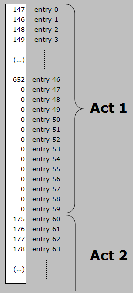

A Type 1 ID in a DS1 is the row number within that act's block of
`MonPreset.txt`, not the `hcIdx` directly. For instance, an Act 2 DS1 with a
Type 1 unit ID of 2 resolves to `MonPreset.txt`'s Act 2 block, row 2 (the
third row, counting 0, 1, **2**) — `drognan`, `hcIdx` 177 in `MonStats.txt`,
`NameStr` *Drognan*. Every act's `MonPreset.txt` block preserves the row order
the pre-1.10 hardcoded table carried, so this is also, unchanged, the example
Siramy gave from that older table: entry 62 (Act 2 starts at entry 60, so
entry 62 is Act 2's row 2) read 177 as well.

### Type 1 units

A Type 1 unit's ID selects a row of `MonPreset.txt` within the DS1's act.
`MonPreset.txt` has 47 rows for Act 1, 59 for Act 2, 39 for Act 3, 28 for Act
4, and 56 for Act 5 — 229 total — each act's block exactly as wide as its
populated row count, with no padding. An ID at or past the end of its act's
block is not rejected: it falls straight through untouched and is used
instead as a direct index — see [Adding a regular Monster to a
DS1](#adding-a-regular-monster-to-a-ds1) for what that index resolves against.
A *negative* ID is never rejected either: `(int)id < count` is satisfied by
any negative number, so it reads backward, out of the current act's block and
into the block(s) before it.

> **Version note (1.09d and earlier).** Each act's block was a fixed 60 slots,
> zero-padded past the populated count — not the exact, variable width
> `MonPreset.txt` blocks have. There was no bounds check of any kind, in
> either direction: `id + act*60` was computed and the dword fetched, full
> stop. An out-of-range ID read into a neighbouring act's slot rather than
> falling through to a monster index, because there was nothing else for it to
> fall through *to* — `MonPreset.txt` did not exist yet.
>
> For instance, an Act 2 DS1 (entries 60–119) with a Type 1 unit ID of −14
> read Act 1's slot 46 instead (60 − 14 = 46), which held the value 652 — not
> a `MonStats.txt` `hcIdx` (`hcIdx` is itself a 1.10 column; 1.09's
> `MonStats.txt` has only 575 records and no record 652), but a SuperUnique:
> Corpsefire. Why 652 nevertheless names Corpsefire is answered in [What the
> binaries do](#what-the-binaries-do). An ID of 62 on the same Act 2 DS1 read
> forward instead, into entry 122 — inside Act 3's block (Act 2 starts at
> entry 60, and 60 + 62 = 122) — rather than the Act 2 unit it was presumably
> meant to be.
>
> That asymmetry is only half gone today. The upper direction changed —
> falling through to a direct index is a different mechanism from a
> wraparound, not merely a narrower one — but the lower direction did not: a
> negative ID still reads backward in 1.13c, the same way, just against
> `MonPreset.txt`'s variable-width blocks instead of the fixed-60 hardcoded
> ones. A 1.09 DS1 that used the trick is not rejected by 1.10 or later — it
> resolves to whatever row now sits at that offset, usually a different
> monster than the DS1 was authored for. That silent corruption is what
> Siramy warns about two sections below.

### Type 2 units

A Type 2 unit's ID selects a row of the hardcoded object table within the
DS1's act — 150 rows per act, IDs 0–149. An ID of 150 or more has 150
subtracted from it, and the remainder is used directly as an `Objects.txt`
record. That subtraction is the entire "new functionality" patch 1.10 gave
Type 2 units, and it is four bytes of assembly:

```asm
6fd5b82f  SUB  EDI, 0x96          ; -= 150
```

reached whenever the signed comparison at `6fd5b80f` finds the ID at or above
150. A negative ID is never rejected: the comparison is signed, so it reads
backward into an earlier act's block. This gives a DS1 of any act access to
every object of any *precedent* act via a negative ID, and — since the
subtraction has no upper clamp — access to every object of *every* act,
including later ones, once the ID is 150 or higher; the practical way to reach
all of them from one DS1 is to place it in Act 5, since Act 5's own block
already starts furthest along the space.

> **Version note (1.09d and earlier).** The same check existed, but the branch
> it guarded did the opposite: `CMP EAX, 0x96` / `JGE` turned an ID of 150 or
> more into `0xFFFFFFFF`, and the unit was **discarded** rather than resolved
> against a later act's objects:
>
> ```asm
> 6fd767fb  CMP  EAX, 0x96
> 6fd76800  JGE  0x6fd768b8         ; discard, not subtract
> ```
>
> Negative IDs already worked exactly as they do now — the comparison was
> already signed, so a DS1 could always reach earlier acts' objects. The one
> thing patch 1.10 changed for Type 2 units was replacing that discard with a
> subtraction, which is why access to *later* acts' objects is new in 1.10 and
> access to *earlier* ones is not.

## MonPreset.txt: the Type 1 lookup table

`MonPreset.txt` is the Type 1 lookup table: one row per resolvable monster
slot, each tagged with an act and a `Place` value. Row order matches the
pre-1.10 hardcoded table exactly — Act 1's first four rows are `gheed`,
`cain1`, `akara`, `chicken` (`hcIdx` 147, 146, 148, 149 in `MonStats.txt` —
*Gheed*, *Deckard Cain*, *Akara*, *chicken*), the same four values the old
table held in the same order. That is not a coincidence: every act's
populated run in the pre-1.10 table — 47, 59, 39, 28, 56 slots — equals
`MonPreset.txt`'s per-act row count exactly, with no interior gaps in either.
`MonPreset.txt` is not a redesign; it is the old table exported as data, with
a name.

Being a TXT rather than DLL bytes means it can be edited (not recommended, but
possible) and extended: a DS1 author is not limited to the sixty entries the
old fixed-width blocks allowed — a single act's block can list the entire
`MonStats.txt` roster and every SuperUnique, if wanted.

`MonPlace.txt` lives in the same lookup space — see [What the binaries
do](#what-the-binaries-do) for how it is wired in — though Siramy considered
it better left alone (unverified as advice, but not baseless: the `Place`
column resolver searches the SuperUniques name index, then MonStats, then
MonPlace, in that order, and 34 of `MonPreset.txt`'s 183 distinct `Place`
values are MonPlace codes, so MonPlace names live in the same namespace and
can shadow).

> **Version note (1.09d and earlier).** Neither `MonPreset.txt` nor
> `MonPlace.txt` exists before 1.10 — not in any 1.09d archive, and 1.09d's
> `D2Common.dll` contains neither string. Both are byte-identical from 1.10
> through 1.14b (`MonPreset.txt`: 3,594 bytes, SHA-1 `d3612b85849b…`). Siramy's
> claim that the mechanism was already present in the 1.10s beta release could
> not be checked here — no 1.10 beta tree is available — and stands on his
> word alone (unverified).
>
> A DS1 authored under the pre-1.10 trick — an out-of-range Type 1 ID reaching
> another act's monsters — is not compatible going forward: nothing rejects
> it, it just silently spawns whatever `MonPreset.txt` now holds at that
> offset. Converting such a DS1 means re-authoring its Type 1 IDs by hand.

## Adding a SuperUnique Monster to a DS1

Let's say you want to use a SuperUnique Monster at the Den of Evil's entrance
— one you created, or one that simply doesn't normally belong to Act 1. For
SuperUnique monsters (found in `SuperUniques.txt`) Siramy says you have no
choice: you *have* to use `MonPreset.txt` (unverified, and the decompile
disagrees — when a Type 1 ID falls past the end of its act's `MonPreset.txt`
block, it passes through untouched as a unit index, and that index space does
not stop at `MonStats.txt`: SuperUniques sit immediately after it, at index
734 in 1.13c, so a direct ID of `734 + 40 = 774` should place Corpsefire with
no `MonPreset.txt` edit at all — see [What the binaries
do](#what-the-binaries-do). That is a decompile-derived prediction, never run
in the game; see the companion report). For regular Monsters/NPC (found in
`MonStats.txt`) a simpler method follows below.

First, make this SuperUnique available for any Act 1 DS1 by editing
`MonPreset.txt` and adding a new row at the end of the Act 1 entries. Using
_Frozenstein_ — normally Act 5's, `SuperUniques.txt` record 59 (`hcIdx` 59,
class `snowyeti4`, already present in `MonPreset.txt`'s Act 5 block at row 46)
— `MonPreset.txt` looks like this:

> 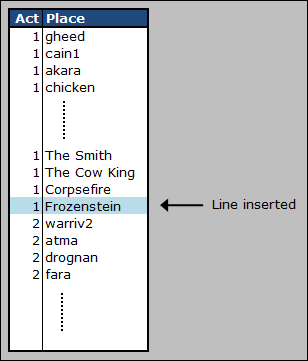

Adding it to Act 1 adds a second reference to the same superunique, not a
copy of it. For the game, this alone is enough to make Frozenstein available
to any DS1 using Act 1 units. But to place it with Siramy's DS1 editor, one
more file needs editing.

In the DS1 editor directory, go into the `Data` sub-directory and edit `Obj.txt`
in MS-Excel or a similar program. This file tells the editor which units can
be placed into a DS1, and to avoid problems it should mirror the game's own
files. Here, some rows already exist below _Corpsefire_, still in Act 1 (Id
47 through 59):

> 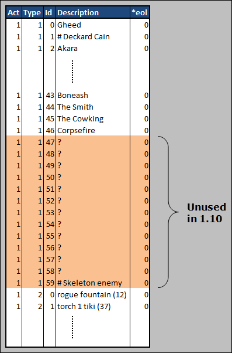

Those are unused entries from when the Type 1 hardcoded table gave 60 entries
per Act. Thirteen consecutive zero dwords sit at `6fdd4234`–`6fdd4267` in
1.09d's `D2Common.dll` — the blank rows in the spreadsheet are blank in the
DLL too.

`Obj.txt`'s Type 1 units should be made the exact reflection of `MonPreset.txt`,
so, as with `MonPreset.txt`, place _Frozenstein_ right after _Corpsefire_,
**inserting a new row if needed** (and adjusting the Id column) — which is not
the case here, so just replace the first unused row. `Obj.txt` should now look
like this:

> 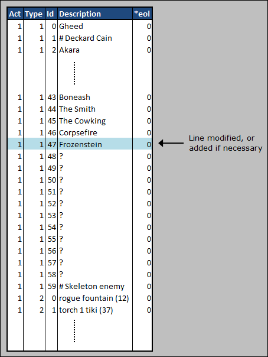

The important columns are **Act**, **Type**, **Id** and **Description**; the
rest are only graphical data for the editor's animated sprite preview, which
is optional. Don't forget the **0** in the **\*eol** column — this ensures
MS-Excel saves the file correctly.

_Frozenstein_ can now be added to the entrance of the Den of Evil DS1. There
are two files, for the two variations, both in `d2data.mpq`, under
`Data\Global\Tiles\ACT1\CAVES`: `denent.ds1` and `denent2.ds1`, using
`LvlPrest` 52 and `LvlType` 2:

> 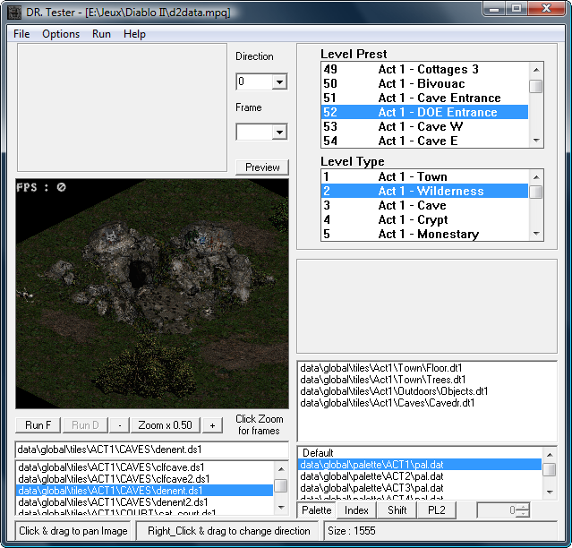

`LvlPrest.txt` record 52 is *Act 1 - DOE Entrance*, `File1` =
`Act1/Caves/DenEnt.ds1`, `File2` = `Act1/Caves/DenEnt2.ds1`, and the remaining
file columns are empty — two variations, as stated. Both files are present in
`D2Data.mpq` at `data\global\tiles\act1\caves\`, each 1,555 bytes, DS1 version
18, 9×9, act field 0. `LvlTypes.txt` record 2 is *Act 1 - Wilderness*: the Den
of Evil entrance is a cave-mouth preset placed into the wilderness level,
which is why its `LvlType` is 2 and not a cave type.

In the DS1 Editor, insert the object _Frozenstein_ near the entrance, in both
DS1 files:

> 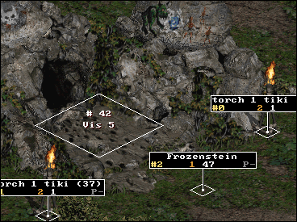

Run the game in `-direct -txt` mode, go to the Den of Evil, and here's the
result:

> 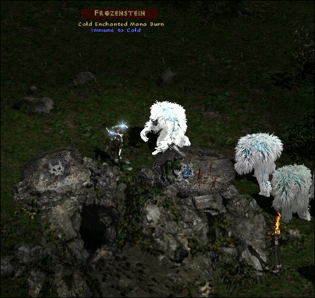

ZIP file with the relevant modded files to place _Frozenstein_ at the entrance
of the Den of Evil: doe_frozenstein_1.13 example files. It contains these 3
files:

* Data\Global\Excel\MonPreset.txt
* Data\Global\Tiles\ACT1\CAVES\denent.ds1
* Data\Global\Tiles\ACT1\CAVES\denent2.ds1

with the TXT file taken from patch_d2.mpq, Patch 1.13.

## Adding a regular Monster to a DS1

To add a monster present in `MonStats.txt` (not `SuperUniques.txt`), there is
no need to place its Id in `MonPreset.txt` at all:

> In a DS1, a Type 1 unit that has an ID which does not represent a valid row
> in `MonPreset.txt` is considered as the **hcIdx** in `MonStats.txt`.

This is the fall-through mechanism described in [Resolving a DS1 unit's
ID](#resolving-a-ds1-units-id): when the ID is past the end of the act's
`MonPreset.txt` block, D2Common's `LoadAndParsePresetArchive` (`6fd5b560`)
leaves it untouched, and it is used directly as a unit index. There is no
`else` branch — Siramy's sentence is a precise description of a fall-through.

That index space is not only `MonStats.txt`. After the lookup, a fixup applies
that silently turns six specific monster indexes into **objects**, depending
on the DS1's act field:

| DS1 act field | Monster index | Becomes object | Object name |
|---|---:|---:|---|
| 2 (Act 3) | 297 `natalya` | 382 | `Dummy` — *natalya start* |
| 2 (Act 3) | 366 `compellingorb` | 404 | `compellingorb` |
| 4 (Act 5) | 514 `nihlathak` | 461 | `dummy` — *Nihlathak Start In Town* |
| 4 (Act 5) | 537 `ancientstatue1` | 476 | *Ancient Statue 2* |
| 4 (Act 5) | 538 `ancientstatue2` | 475 | *Ancient Statue 1* |
| 4 (Act 5) | 539 `ancientstatue3` | 474 | *Ancient Statue 3* |

The three statue indexes are computed as `1013 - id`, which is why the
mapping comes out permuted rather than parallel. This fixup fires on the
resolved index, so it catches the `MonPreset.txt` route as well as the direct
one, and it has identical constants in 1.09d and 1.13c — it is not a version
difference, just a hazard the direct-index method needs to know about.

This is how almost any Monster/NPC present in `MonStats.txt` can be placed in
a DS1 of any Act: _QuillRat_, _BloodLord_, _Larzuk_, _Radament_, _Diablo_...
As for the "almost": monsters at the start of `MonStats.txt` whose `hcIdx`
represents a valid row in `MonPreset.txt` cannot be reached this way, because
the `MonPreset.txt` entry is taken instead. To place a monster with such a low
`hcIdx`, put its code (the `Id` column in `MonStats.txt`) into `MonPreset.txt`,
the same as for a SuperUnique monster.

With the un-modded table, `MonPreset.txt` has 47 entries for Act 1, indexes 0
to 46. So, in a DS1 using Act 1 units, a Type 1 unit with an ID of 46 is
_Corpsefire_, while an ID of 47 is the Monster/NPC with `hcIdx` 47 in
`MonStats.txt`: `corruptrogue5`, *FleshHunter*.

In the earlier example, a new row was added to Act 1 of `MonPreset.txt` for
_Frozenstein_. With that edit, an ID of 46 is still _Corpsefire_ as expected,
but an ID of 47 is now _Frozenstein_ rather than _FleshHunter_. An ID of 48 is
still taken from `MonStats.txt`: `hcIdx` 48, `baboon1`, *DuneBeast*.

Here's a diagram showing the logic, for the un-modded table. Act 2's block has
59 rows, IDs 0 to 58. In a DS1 using Act 2 units, ID 58 is found in
`MonPreset.txt` (row 58 = `skeleton5`), but ID 59 is not — it falls through to
`MonStats.txt`, `hcIdx` 59, `fallenshaman2`, *CarverShaman*:

> 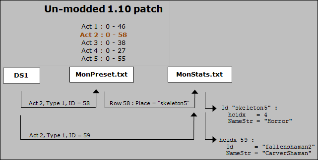

To place _Diablo_ in an Act 3 DS1 — `hcIdx` 243 in `MonStats.txt`, greater than
Act 3's 38 highest row — there are two solutions:

* Direct index: place a Type 1 unit with ID **243**.
* Indirect index: in `MonPreset.txt`'s Act 3 block, put _diablo_ in the
  **Place** column, and in the DS1 use the row it lands on. With no other
  additions to Act 3, that row is 39 (the last existing row, 38, is `Maffer
  Dragonhand`), so the DS1 uses ID **39**.

Both methods work; it is a matter of preference. Neither prevents corrupting
the DS1 if rows are deleted or inserted in `MonPreset.txt` and/or
`MonStats.txt`, so — as often as possible — only **add** rows to these files,
to avoid needing to re-edit already-authored DS1s.

Whichever method is chosen, `Obj.txt` in the DS1 editor needs the matching
entry: the `MonStats.txt` `hcIdx` for the first method, the `MonPreset.txt`
row number for the second.

### First method (direct index)

Insert _Diablo_ in `Obj.txt` (Act 3, type 1 list, using `MonStats.txt`
`hcIdx`):

> 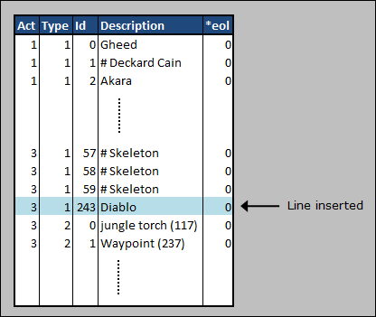

_Diablo_ can now be added to the Act 3 Town DS1. The file is in `d2data.mpq`,
under `Data\Global\Tiles\ACT3\Docktown`: `docktown3.ds1`, using `LvlPrest` 529
and `LvlType` 20. `LvlPrest.txt` record 529 is *Act 3 - Town*, `File1` =
`Act3/Docktown/DockTown3.ds1`, `LevelId` 75; `Levels.txt` record 75 is *Act 3 -
Town* with `LevelType` 20, and `LvlTypes.txt` record 20 is *Act 3 - Town*. The
file itself is `data\global\tiles\act3\docktown\docktown3.ds1` in `D2Data.mpq`,
118,210 bytes, DS1 version 18, 65×49, act field **2** — the field that sends
the Type 1 lookup into `MonPreset.txt`'s Act 3 block.

> 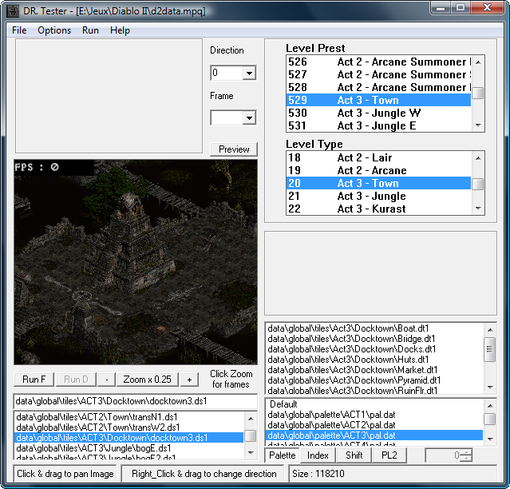

In the DS1 Editor, insert the object _Diablo_ where wanted:

> 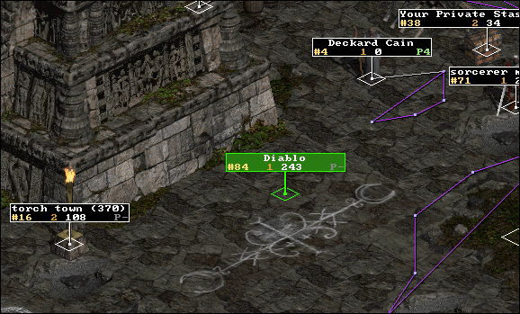

Run the game in `-direct` mode, go to Act 3, then to the placed _Diablo_:

> 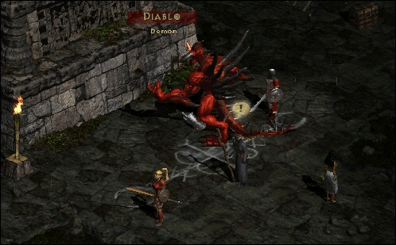

ZIP file with the modified DS1 docktown3.ds1: act3_town_diablo_method1 example
files.

### Second method (indirect index)

Insert _Diablo_ in `MonPreset.txt` (row 39 of the Act 3 Type 1 list):

> 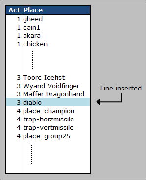

Edit or insert _Diablo_ in `Obj.txt` (Act 3, Type 1 list, using the row number
in `MonPreset.txt`):

> 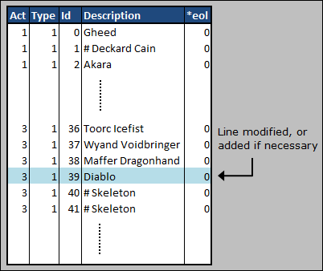

Insert _Diablo_ into the Act 3 DS1, using the DS1 Editor:

> 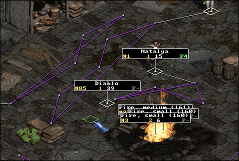

Run the game in `-direct -txt` mode, go to Act 3, then to the placed _Diablo_:

> 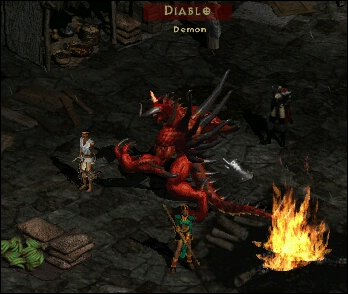

ZIP file with the modified files: act3_town_diablo_method2 example files. It
contains:

* Data\Global\Excel\MonPreset.txt
* Data\Global\Tiles\ACT3\Docktown\docktown3.ds1

with the TXT file taken from patch_d2.mpq, Patch 1.13.

## Adding an Object to a DS1

The Type 2 (object) mechanism is described in full in [Resolving a DS1 unit's
ID](#resolving-a-ds1-units-id): an ID below 150 indexes the hardcoded per-act
table; an ID of 150 or more has 150 subtracted and is used directly as an
`Objects.txt` record; a negative ID reads backward into an earlier act's
block. Note that a Type 2 Object ID of exactly 150 is unusable (unverified:
`150 - 150 = 0`, and Siramy warns that in `Objects.txt` the object with ID 0
crashes the game — this was not reproduced here; object record 0 is named
`Dummy`, described *"test data"*, which is consistent with the warning but is
not evidence for it).

Subtracting 150 from the DS1 Type 2 ID gives access to *all* of `Objects.txt`,
unlike Type 1 units, where the lowest `hcIdx` values cannot be reached this
way. Here are different objects from all five acts, usable in an Act 1 DS1:

| Description | Act | Objects.txt ID | | DS1 Editor ID |
|---|---:|---:|---|---:|
| Trap Door | 2 | 74 | + 150 = | **224** |
| Lam Esen's Tome | 3 | 193 | + 150 = | **343** |
| Diablo seal | 4 | 392 | + 150 = | **542** |
| Ancients Altar | 5 | 546 | + 150 = | **696** |

Read against `Objects.txt`, using the game's own record numbering: 74 is
`TrappDoor`, 193 is `LamTome`, 392 is `Seal`, 546 is `ancientsaltar`. That last
one is the trap in this table: `Objects.txt` carries an `Expansion` divider
line whose `Id` column is blank, after which the `Id` column runs one behind
the raw file line — the Ancients Altar is file line 547 but object **546** to
the game. The `Id` column is authoritative; a spreadsheet row counter would
give 545, `deadperson2`, and place a corpse instead. (The same off-by-one
applies to `Levels.txt` and `LvlTypes.txt`: Harrogath is `Levels.txt` line
110, object **109**, the number every D2 player knows.) Trap Door has a second
confirmation: it is entry 0 of the Act 2 block of D2Common's own Type 2
table, unchanged since 1.09d.

Insert the 4 new object IDs in `Obj.txt`:

> 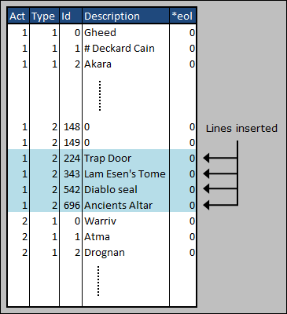

These 4 objects can now be added to one of the four variations of the Act 1
Town DS1. The file is in `d2exp.mpq`, under `Data\Global\Tiles\ACT1\Town`;
`townE1.ds1` is used here, with `LvlPrest` 1 and `LvlType` 1. `LvlPrest.txt`
record 1 is *Act 1 - Town 1*, and its file columns hold exactly four entries —
`TownN1.ds1`, `TownE1.ds1`, `TownS1.ds1`, `TownW1.ds1` — the four variations.
`LvlTypes.txt` record 1 is *Act 1 - Town*. `townE1.ds1` is present in
`D2Exp.mpq` at `data\global\tiles\act1\town\`, 57,691 bytes, DS1 version 18,
57×41, act field 0 (also present in `D2Data.mpq` at the same size; naming
`d2exp.mpq` matches the archive the game reads first):

> 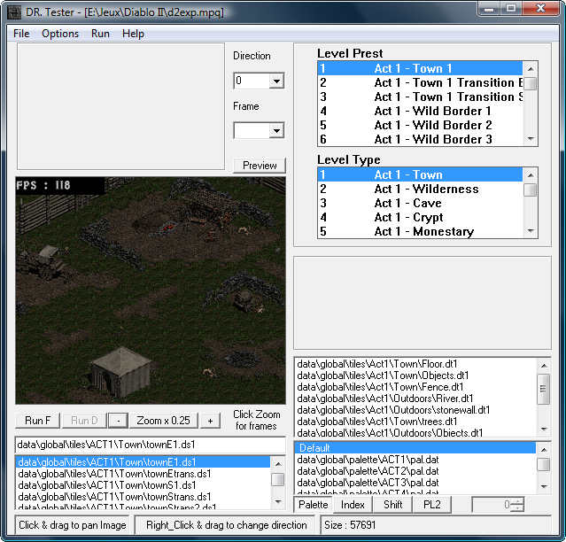

To make it work for this test, edit `LvlPrest.txt` and force the 4 Act 1 town
variations to be `TownE1.ds1`:

> 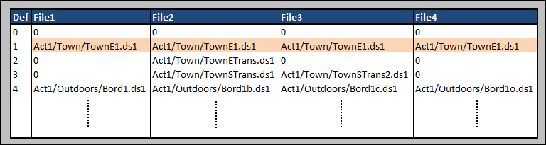

Place the 4 objects of later acts somewhere in the Rogue Camp, using the DS1
Editor:

> 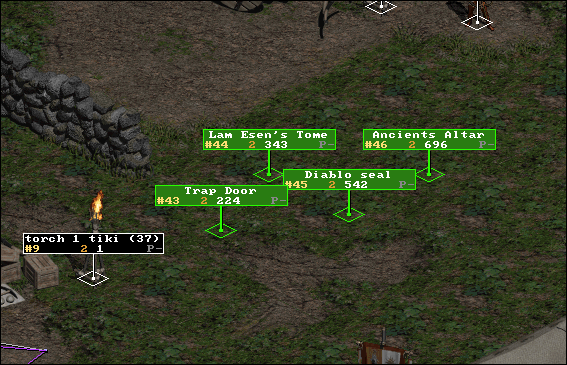

Run the game in `-direct -txt` mode and go to the placed objects:

> 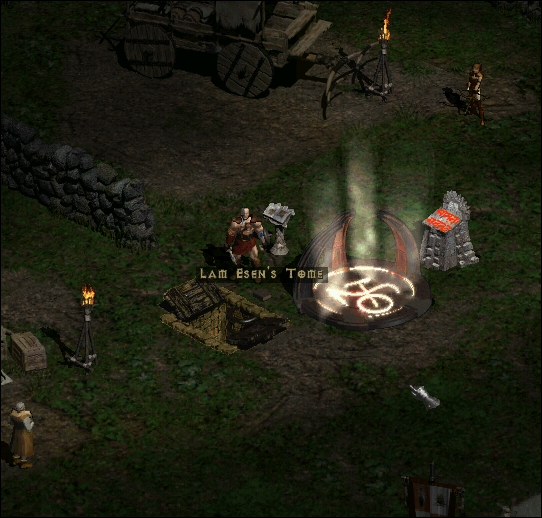

The objects look like they're working (more or less).

ZIP file with the modified files: act1town_4objects example files. It
contains:

* Data\Global\Excel\LvlPrest.txt
* Data\Global\Tiles\ACT1\Town\townE1.ds1

with the TXT file taken from patch_d2.mpq, Patch 1.13.

---

## What the binaries do

*This section was added in 2026 and is not Paul Siramy's work. It exists to
answer the one question he left open.*

Every unit in a DS1 is four dwords — a type, an ID, and a pair of coordinates
— plus a fifth flags dword from DS1 version 6 onward. The type is 1 for a
monster and 2 for an object. The ID is what this whole tutorial is about.
D2Common turns that pair into something the game can spawn inside one
function: `LoadAndParsePresetArchive`, at `6fd5b560` in 1.13c and `6fd76530`
in 1.09d.

The function names its own source file, because every allocation it makes
passes a file and line to the leak tracker. In 1.13c the strings are
`..\Source\D2Common\DRLG\Preset.cpp` and `..\Source\D2Common\DRLG\DrlgRoom.cpp`.
In 1.09d the same two files read
`C:\Src\Diablo2\Source\D2Common\DRLG\Preset.cpp` and
`C:\Src\Diablo2\Source\D2Common\DRLG\DrlgRoom.cpp`. Somewhere between the two
patches the build switched to relative paths; before that, every shipped copy
of `D2Common.dll` carried the layout of the machine it was compiled on.

For objects, the mechanism is short and has not changed in shape since 1.09:
one table of 750 dwords, five blocks of 150, indexed by `act*150 + id`. Below
150, the table entry is used. At 150 or above, 1.09 threw the unit away; 1.13c
subtracts 150 and treats the remainder as a direct `Objects.txt` record. That
subtraction is the entire "new functionality" for Type 2 units.

For monsters, the mechanism is the one Siramy could not finish looking into.

### The index space

The number that comes out of the Type 1 lookup is not a `MonStats.txt` row —
it is an index into three tables laid end to end, and D2Common builds that
space explicitly. `MonPreset.txt`'s `Place` column is resolved by a small
function at `6fda2e70` that tries three name indexes in turn and tags the
record with which one matched:

| Tag | Name index searched | Resolves to |
|---:|---|---|
| 2 | the SuperUniques name index | `index + nMonStats` |
| 1 | the MonStats name index | `index` |
| 0 | the MonPlace name index | `index + nMonStats + nSuperUniques` |

The three tables are searched in that order, and the tags are read straight
back out of the record by the parser. Two of the identifications come from the
binary: the tag-2 index is the pointer written by
`MONSTERS_LoadSuperUniquesTable`, and the tag-1 index is the one the same
loader uses to resolve a superunique's `Class` field — that is, MonStats. The
third is settled by the data: all 183 distinct `Place` values in
`MonPreset.txt` resolve in exactly one of `MonStats.txt`, `SuperUniques.txt`
and `MonPlace.txt`, with none left over and none ambiguous; `place_nothing`
appears only in `MonPlace.txt`, so the remaining index must be MonPlace's.

`nSuperUniques` is the record count returned when `superuniques` is parsed in
`MONSTERS_LoadSuperUniquesTable` at `6fda9870` — the same function that caps
the table at 512 records and refuses to start if any of the 66 `hcIdx` slots
is unfilled. In 1.13c the arithmetic comes out as:

| Range | Table | Size |
|---|---|---:|
| 0 – 733 | `MonStats.txt` | 734 |
| 734 – 799 | `SuperUniques.txt` | 66 |
| 800 – 836 | `MonPlace.txt` | 37 |

So "the ID is the `hcIdx`" is true for the first 734 values, and stops being
true after that. Past 734 the same fall-through addresses superuniques; past
800, the `place_*` pseudo-monsters.

### 652

Back to 1.09. Its `MonStats.txt` has 575 records, so there is no record 652 —
Siramy was right that the number is not a monster row, and right that it is
Corpsefire, and stopped there because from outside the DLL there was nothing
else to see.

Reading the neighbouring entries of the Act 1 block, the pattern falls out.
The last four populated slots hold 621, 632, 651 and 652 — Boneash, The
Smith, The Cow King and Corpsefire, `SuperUniques.txt` records 9, 20, 39 and
40:

| Table value | Superunique | `SuperUniques.txt` record | value − record |
|---:|---|---:|---:|
| 621 | Boneash | 9 | 612 |
| 632 | The Smith | 20 | 612 |
| 651 | The Cow King | 39 | 612 |
| 652 | Corpsefire | 40 | 612 |

Four entries, one constant. In 1.09, the superunique block begins at index
612, and 652 is offset 40 inside it.

That leaves 612 − 575 = 37 indexes between the end of MonStats and the start
of the superuniques in 1.09's space. `MonPlace.txt`, when Blizzard shipped it
in 1.10, had exactly 37 rows. The band was already there in 1.09; the patch
gave it a filename and moved it to the end of the space, which is why the same
DS1 ID resolves differently before and after 1.10 (unverified beyond
arithmetic: the 1.09 consumer of this index space lives outside
`D2Common.dll` and was not decompiled — see the companion report).

Siramy's *"for some reasons"* was not a gap in his method. It was the edge of
what the TXT files alone can tell you. The table he was reading was correct,
his arithmetic was correct, his answer was correct; the only thing he lacked
was the one fact that 652 was never a monster ID in the first place.

---

## Appendix: verified constants

Everything below was read out of the binaries and archives named in
[Origin](#origin). Addresses are file/preferred-base addresses.

### D2Common hardcoded tables

| Table | Version | Address | Layout | Total |
|---|---|---|---|---:|
| Type 2 (objects) | 1.13c | `6fdee2c8` – `6fdeee7f` | 5 acts × 150 dwords | 750 |
| Type 2 (objects) | 1.09d | `6fdd35c0` – `6fdd4177` | 5 acts × 150 dwords | 750 |
| Type 1 (monsters) | 1.13c | — moved to `MonPreset.txt`, variable per-act width | | |
| Type 1 (monsters) | 1.09d | `6fdd4178` – `6fdd4627` | 5 acts × 60 dwords | 300 |

The two 1.09d tables are adjacent: the Type 1 table starts at the byte after
the Type 2 table ends. The Type 2 table is byte-identical between 1.09d and
1.13c across all 3,000 bytes.

### The DS1 unit parser

| Version | Function | Address |
|---|---|---|
| 1.13c | `LoadAndParsePresetArchive` | `6fd5b560` |
| 1.09d | (unnamed) | `6fd76530` |

| Behaviour | 1.13c | 1.09d |
|---|---|---|
| Act field read from DS1 header | version ≥ 8, clamped to ≤ 4 | same |
| Type 1 lookup (DS1 version ≥ 5) | `MonPreset.txt` block, `id < rows[act]` only | `table[id + act*60]`, **no bounds check** |
| Type 1 out of range | falls through as a direct unit index | reads a neighbouring act's slot |
| Type 2 lookup (DS1 version ≥ 6) | `table[id + act*150]` if `id < 150` | same |
| Type 2 `id >= 150` | `id - 150`, used as an `Objects.txt` record | discarded (`-1`) |
| Type 2 in a DS1 older than version 6 | raw ID, except `0x23d` → discarded | same |
| Act 3 / Act 5 monster→object fixups | present | present, identical constants |
| Type 1 in a DS1 older than version 5 | unit not created | unit not created |

Runtime globals in 1.13c: `6fdf0980` the MonPreset record array, `6fdf0984`
five per-act base pointers, `6fdf0998` five per-act row counts, all written by
the `monpreset` loader at `6fda5490`.

### Per-act row counts

| Act | `MonPreset.txt` rows, 1.13c (1.10 – 1.14b) | 1.09d hardcoded slots used (of 60) |
|---:|---:|---:|
| 1 | 47 | 47 |
| 2 | 59 | 59 |
| 3 | 39 | 39 |
| 4 | 28 | 28 |
| 5 | 56 | 56 |

### Table record counts as the game numbers them

The `Expansion` divider line is not a record. Every `Id`/`hcIdx`/`Def` column
in these files is authored on that basis, and so is every index in the DLL —
the same counting rule, and the same loader family that parses these tables
from `Patch_D2.mpq`/`D2Exp.mpq` in the first place, is covered in
[Excel tables and data loading](excel-tables-and-data-loading.md).

| File | Version | Records | Divider at file line |
|---|---|---:|---:|
| `MonStats.txt` | 1.13c | 734 | 410 |
| `MonStats.txt` | 1.09d | 575 | 410 |
| `SuperUniques.txt` | 1.13c / 1.09d | 66 | 42 |
| `Objects.txt` | 1.13c / 1.09d | 573 | 410 |
| `MonPreset.txt` | 1.13c (1.10 – 1.14b) | 229 | — |
| `MonPlace.txt` | 1.13c (1.10 – 1.14b) | 37 | — |

Divider positions are data-line numbers counting from zero with the header
excluded. `SuperUniques.txt`'s 66 is independently confirmed by the binary:
`MONSTERS_LoadSuperUniquesTable` initialises exactly `0x42` `hcIdx` slots and
aborts if any is left unfilled.

`MonPreset.txt` and `MonPlace.txt` do not exist in 1.09d, in any archive, and
1.09d's `D2Common.dll` contains neither string.

### Names behind the numbers used in this chapter

| `MonStats.txt` record | `Id` | `NameStr` |
|---:|---|---|
| 47 | `corruptrogue5` | FleshHunter |
| 48 | `baboon1` | DuneBeast |
| 59 | `fallenshaman2` | CarverShaman |
| 146 | `cain1` | DeckardCain |
| 147 | `gheed` | Gheed |
| 148 | `akara` | Akara |
| 149 | `chicken` | dummy |
| 177 | `drognan` | Drognan |
| 243 | `diablo` | Diablo |
| 652 | `bloodlord6` | Blood Lord1 |

| `SuperUniques.txt` record | Name | Class |
|---:|---|---|
| 40 | Corpsefire | `zombie1` |
| 59 | Frozenstein | `snowyeti4` |

## Version differences

Every place this chapter marks a `Version note` for the pre-1.10 era, in one
table. 1.10 through 1.14b behave identically to 1.13c for everything below;
the only divergent era is 1.09d and earlier.

| What | 1.13c | 1.09d and earlier (pre-1.10) |
|---|---|---|
| Type 1 (monster) index source | `MonPreset.txt`, via the runtime table the `monpreset` loader builds (`6fda5490`) | hardcoded table in `D2Common.dll`, `6fdd4178`–`6fdd4627` |
| Type 1 act-block width | variable — exactly the act's `MonPreset.txt` row count (47 / 59 / 39 / 28 / 56) | fixed 60 slots per act, zero-padded past the populated count |
| Type 1 ID at/past the act's block end | falls through as a direct index (the "regular Monster" method) | reads forward into the next act's slot — no upper bound existed |
| Type 1 negative ID | reads backward across earlier acts' `MonPreset.txt` blocks — no lower bound was ever added | reads backward across earlier acts' hardcoded-table blocks — same absence of a check |
| Type 1 resolved index space | `MonStats.txt` [0, 734) → `SuperUniques.txt` [734, 800) → `MonPlace.txt` [800, 837) | raw hardcoded-table value; `MonStats.txt` [0, 575) → 37 unused indexes [575, 612) → `SuperUniques.txt` [612, 678); `MonPlace.txt` does not exist |
| `MonPreset.txt` | present, 229 records | absent |
| `MonPlace.txt` | present, 37 records | absent |
| `MonStats.txt` `hcIdx` column | present | absent |
| `MonStats.txt` records | 734 | 575 |
| Type 2 (object) index source | hardcoded table, `6fdee2c8`–`6fdeee7f` | hardcoded table, `6fdd35c0`–`6fdd4177` — byte-identical to the 1.13c copy |
| Type 2 ID ≥ 150 | 150 subtracted; remainder used as a direct `Objects.txt` record | discarded — the unit is not created |
| Type 2 negative ID | reads backward across earlier acts' object-table entries | same |
| `Objects.txt` records | 573 | 573 (four bytes differ from the 1.13c copy; no rows do) |
| `SuperUniques.txt` records | 66 | 66 |
| Act 3 / Act 5 monster→object fixup (6 IDs) | present | present, identical constants |
| DS1 Act field, Type 1/Type 2 version gating | version ≥ 8 for Act field, ≥ 5 for Type 1, ≥ 6 for Type 2 flags | same |

A reader on 1.13c can skip every `Version note` above this table and still
have a complete, correct chapter; this table exists so a reader who needs the
pre-1.10 picture can find every delta in one place.

Full claim tally, evidence for each row, and everything this pass could not
settle: [`monsters-and-objects.verification.md`](monsters-and-objects.verification.md).
